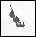
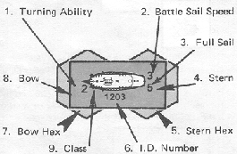
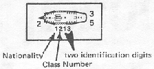
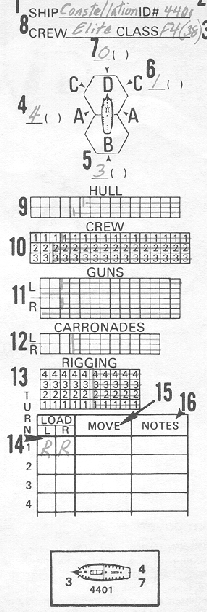

Introduction to Rules
=====================

I. Introduction
---------------

Wooden Ships and Iron Men is a tactical simulation of naval warfare
during the great age of sail. The game covers the period from 1776 to
1814 when the great square sail ships-of-the-line dominated the oceans
and the speedy and durable American frigates gave world recognition to
their young parent navy. The game is played by two or more players each
commanding a ship, squadron, or whole fleet! Scenarios depict the famous
naval engagements of the American and French Revolutions and the
Napoleonic Wars. The game is also a kit from which other scenarios or
any fictitious engagement may be designed.

Each counter represents a single ship and covers two hexes of the
mapboard. Orders for movement are written for each ship on a "log".
Ships are then moved simultaneously over the mapboard. Any which foul or
grapple may attempt to form boarding parties to take possession of the
enemy's craft by force. Ships may also fire at the opposing vessels
hoping to reduce them to a state of surrender. Careful maneuvering and
good fleet organization are essential to defeat the enemy and gain
victory.

II. Components
--------------

### A. Game Equipment

1.  Mapboard consisting of two sections which can be joined together in
    a variety of ways to allow more freedom of movement.
2.  Set of die-cut counters.
3.  Advanced Tables Card.
4.  Rules of play and scenario manual.
5.  A "log" pad.
6.  One die.

### B. Mapboard

The 22" by 28" mapboard is the playing surface upon which the ships
are maneuvered. The hexagonal grid printed on the mapboard is used to
determine movement, firing ranges, and the positions of the ships. Each
hex (hexagon) has an identification code, this being used to determine
the initial placement of ships for the various scenarios. The code is
also valuable in checking a ship's movement. Portions of the board are
sometimes used as juttings of land in certain scenarios, and will be
defined as such in the applicable scenario. A wind direction hexagon is
found at the lower lefthand corner. Each edge of the board is labeled by
the wind direction numbers pointing toward it. The four edges are
labeled in clockwise order, 1, 2-3, 4, 5-6.

### C. Unit Counters

Included in the game is a sheet of die-cut counters which represent
ships and markers of various types. These are the playing pieces used in
the game. Each counter has a colored spot amidships to identify it and
act as the ship's colors. Red spots identify British ships; white spots
identify French vessels; gold spots identify Spanish and Venetian ships;
and light blue spots identify the American vessels. Printed on each
counter is information needed to play the game. Examine the examples
below:

+-----------------------------------+-----------------------------------+
| {w |                                   |
| idth="35"                         |                                   |
| height="37"}                      |                                   |
+-----------------------------------+-----------------------------------+
| {width=" |                                   |
| 37"                               |                                   |
| height="36"}                      |                                   |
+-----------------------------------+-----------------------------------+
| {width | Strike                            |
| ="36"                             |                                   |
| height="37"}                      |                                   |
+-----------------------------------+-----------------------------------+
|  | Explosion                         |
| {width="37"                       |                                   |
| height="37"}                      |                                   |
+-----------------------------------+-----------------------------------+
| {wid | Sinking                           |
| th="36"                           |                                   |
| height="37"}                      |                                   |
+-----------------------------------+-----------------------------------+

Ship Classes: Each ship overview on the counter represents a class of
ship. Classes denote different sizes and types of ships. NOTE: Care must
be used to match the proper class counter for each ship being played.
The size of a ship is indicated by the size of the class overview.

+-----------------------------------+-----------------------------------+
| {width=" |                                   |
| 105"                              |                                   |
| height="50"}                      |                                   |
+-----------------------------------+-----------------------------------+
| {width=" |                                   |
| 106"                              |                                   |
| height="51"}                      |                                   |
+-----------------------------------+-----------------------------------+
| {width="104"    |                                   |
| height="52"}                      |                                   |
+-----------------------------------+-----------------------------------+
| {width="105"   | Corvette (C)                      |
| height="52"}                      |                                   |
+-----------------------------------+-----------------------------------+
| {width="105 | Schooner (SC)                     |
| "                                 |                                   |
| height="52"}                      |                                   |
+-----------------------------------+-----------------------------------+
| {width="105" | Radeau (R)                        |
| height="52"}                      |                                   |
+-----------------------------------+-----------------------------------+
| {width="52" |                                   |
| height="52"}                      |                                   |
+-----------------------------------+-----------------------------------+
| {width="1 |                                   |
| 07"                               |                                   |
| height="52"}                      |                                   |
+-----------------------------------+-----------------------------------+
| {width="1 |                                   |
| 09"                               |                                   |
| height="51"}                      |                                   |
+-----------------------------------+-----------------------------------+
| {width=" |                                   |
| 108"                              |                                   |
| height="52"}                      |                                   |
+-----------------------------------+-----------------------------------+
| {width=" | rules)                            |
| 107"                              |                                   |
| height="51"}                      |                                   |
+-----------------------------------+-----------------------------------+

{width="265"
height="173"}

1.  Turning Ability: The maximum number of 60 degree turns which that
    ship can make during the course of the Movement Execution Phase.
2.  Battle Sail Speed: The maximum speed that a ship has under battle
    sails. (There are two speeds, 3 and 4).
3.  Full Sail Speed: The lower righthand number represents a ship's
    movement ability under an increased spread of sail. This speed is
    used in the Advanced Game only.
4.  Stern: The stern of a ship is its rear section. This is the blunt
    end of the ship diagram on the counter.
5.  Stern Hex: The hex that the stern and the rear half of the ship
    occupies.
6.  Identification number: Each counter has a 4 digit number which is
    used to identify it with the ship that it represents. The first
    digit refers to the nationality of the vessel. The second digit
    refers to the class of ship. (See below) The last two digits serve
    to identify the counter as separate from any other.\
    {width="224"
    height="101"}
    Nationality
7.  Bow Hex: The hex that the bow and the forward half of the ship
    occupies.
8.  Bow: The bow of a ship is its front. This is the pointed end of the
    ship diagram on the counter. The bow always points in the direction
    in which the ship is sailing.

### D. Basic Game and Advanced/Optional Tables

1.  The back of this manual contains the Basic Game Tables necessary for
    the play of the game. Each Table is identified and its use will be
    explained in the appropriate section of rules. Hereafter all Tables
    will be referred to in abbreviated form.

    (Meaningless cross reference...)

2.  The Advanced/Optional Tables differ from the Basic Game Tables and
    are located on a separate card.

### E. Log Sheet Pad

All the essential information needed for moving and firing ships is
placed here.

III. Prepare For Play
---------------------

### A. Mapboard Set Up

1.  A Scenario is selected from the Scenario section of this manual. All
    information necessary for the set-up is found in the scenario. It is
    better to start with single ship encounters and move on from there
    as experience is gained.
2.  Remove from the counter sheet a counter of proper nationality and
    class for each ship to be played.
3.  Lay the mapboard out and place each ship's bow in the assigned bow
    hex and pointing in the numbered direction corresponding to the wind
    direction hex on the board.
4.  The wind arrow counter is placed in the wind direction hex pointing
    to the proper numbered direction.
5.  If the scenario has any land features involved, the hexes to be
    noted as land will be listed.

### B. Log Sheet

A very important step must now be completed; filling out the log sheet.
A player must fill out a "log" for each ship that he controls. All
information for that ship necessary to the play of the game will be
placed here. This information is found on the ship counter or in the
ship's Order of Battle, found in the scenarios. A diagram is given as
an example of this procedure.

{width="207" height="612"}

(Image incomplete...)

The ship counter and log above represent the starting Basic Game
strength of the Constellation. Check her specifications on the Master
Scenario Chart on Page 27 to ascertain how to correct fill out a ship's
log.

(Meaningless cross reference...)

1.
:   The name of the ship and number of gun carried is placed on line 1.

2.
:   The identification number of counter to be used for the ship is put
    on line 2.

3.
:   The Class of ship is placed on line 3. Certain ships may be given a
    specific counter to use in the scenario. This will be indicate by
    giving the I.D. number in this section.

4., 5., 6., and 7.\

:   On lines 4, 5, 6, and 7 place movement allowance for each attitude
    to wind. This information can be found in Movement section of the
    Basic Game (IV A. 3., 4.).

    (Meaningless cross reference...)

    Ignore parenthesis for Basic Game a these spaces are intended for
    full-sail movement in the Advanced Game.

8.
:   The quality of crew manning the ship either elite, crack, average,
    green or poor is placed on line 8.

9.
:   The number of hull squares allotted for each ship is placed in
    section 9. All squares over this number are marked out.

10.
:   The number of crew squares allotted to each ship is placed in
    section 10. All crew squares are divided into sections. In the Order
    of Battle, the number of sections and number of crew squares per
    section will be given. Each crew section has a corresponding
    numbered row in the "log". Squares not being used should be marked
    out.

11.
:   The number of gun squares allotted for each ship is placed in
    section 11. This section divides the guns into left and right
    broadsides (labeled L and R). Mark out the gun squares not being
    used.

12.

:   Section 12 is the Carronade section. This section is completed
    exactly like section 11. Carronades are special guns of limited
    range, hence the reason for separation from section 11.

    (Meaningless cross reference...)

13.
:   Section 13 is the Rigging section. Each line of squares represent
    one battle sail speed factor. The number of rigging squares per
    battle sail speed factor is given in the Order of Battle. Squares
    not being used are marked out.

14.
:   On the movement column (14) of the ship's log, there is a load
    section. It is composed of two spaces, one marked L for left
    broadside; the other R for right broadside. In these spaces the type
    of shot for each broadside is to be marked. There are 4 types of
    shot to be used, roundshot, chainshot, grapeshot, and doubleshot.
    Each has advantages and disadvantages to be discussed later. You can
    load each broadside with one type of shot although both broadsides
    need not have the same type. The spaces in the load column are
    marked: R for roundshot, G for grapeshot, or D for doubleshot. For
    the basic game only roundshot is to be used.

15.
:   Section 15 denotes the move column. All movement for the ship will
    be placed here. No information is placed here at this time.

16.
:   The notes section (16) is the part of the moves column where special
    orders and notations are written. These notations will be explained
    in appropriate sections of the rules. No information is placed here
    at this time.
