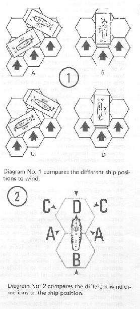
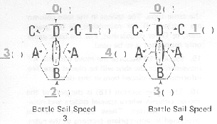
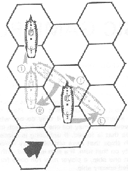
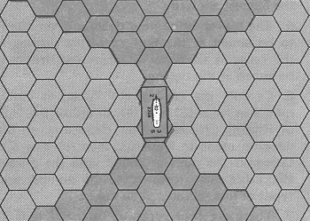

[Basic Game Rules]{#hd01 .header}
=================================

[I. Introduction]{#hd02 .header}
--------------------------------

The Basic Game gives all the information needed to play a scenario in
Wooden Ships and Iron Men. Once this section of the rules is completed,
play of the game can begin. Later rule sections include an Advanced Game
and an Optional Rules section which provide more realism and
corresponding complexity. There is even an additional section of rules
which allows players to design their own scenarios.

The rules outline for the Basic Game follows the sequence of play for
each turn.

[II. Sequence of Play]{#hd03 .header}
-------------------------------------

Once the game has been set up, play begins. The game is played in turns
(representing approximately three minutes). Most scenarios have no limit
to the number of turns contained therein. Each turn is divided into
eight phases. The sequence of play for each turn is as follows:

A.  Unfouling Phase: Make attempts to unfoul ships which were fouled on
    previous turns.
B.  Movement Notation Phase: Players secretly write in the proposed
    movements for each ship on their log sheets.
C.  Movement Execution Phase: When both players have completed their log
    notations, all simultaneously move exactly as their movement was
    written in the log. Retrace any possible collisions one hex at a
    time. if any collisions occur check for fouling.
D.  Grappling and Ungrappling Phase: Make all attempts to grapple, avoid
    grappling, and ungrapple.
E.  Boarding Preparation Phase: Write any boarding parties in the logs
    of the involved ships.
F.  Combat Phase: Resolve all gunfire, and mark all hits on the hit
    boxes of the log sheet.
G.  Melee Phase: Resolve all boarding actions, and mark all crew hits on
    the log sheet.
H.  Load Phase: Load broadsides.

[III. Unfouling Phase]{#hd04 .header}
-------------------------------------

Ships which have fouled their rigging (i.e., have entangled their
rigging with that of other ships) on previous moves and have not been
able to unfoul may attempt to unfoul. Ships attempting to unfoul use the
Unfouling Table. Players need not attempt to unfoul if they do not wish
to; however, they may roll one die for each of their ships that is
fouled. If unfouling is successful, both ships that have unfouled may
move normally on that turn. If a ship is fouled with more than one ship,
a player may roll once for each fouled enemy ship.

If after the completion of all unfouling attempts, any ship still
remains fouled to one or more enemy ships, it must wait till next turn
to attempt to unfoul.

Successful Unfouling is noted by writing (F) in the notes section of the
log.

[IV. Movement Notation Phase]{#hd05 .header}
--------------------------------------------

All ships are moved simultaneously. The move of each ship must be
written secretly in the log before any ship can actually be moved on the
mapboard.

### A. Movement and Turning Allowance

1.  Before writing orders, the movement allowance for each ship must be
    determined. This movement allowance is a combination of a ship\'s
    battle sail speed and its attitude to the wind direction.
2.  The battle sail speed of each ship is printed on the counter
    adjacent to the stern of the ship diagram (see 11, C. 2 of
    Introduction to Rules). All ships have a battle sail speed of
    either 3 or 4.

    (Meaningless cross reference\...)

3.  Along with the battle sail speed the attitude of the ship in
    relation to the wind must be determined. There are four attitudes to
    the wind for each ship, labeled A, B, C, D. Each letter represents a
    different position of the ship in relation to the direction that the
    wind is blowing. See diagram:\
    {width="278" height="611"}
4.  The movement allowance is now checked on one of these two charts:\
    {width="305" height="175"}
    Examples:
    a.  A ship with a battle sail speed of 3 starts the movement
        notation phase in attitude C in relation to wind direction. Its
        movement allowance is determined to be 1.
    b.  A ship with a battle sail factor of 4 starts the movement
        notation phase in attitude A. Its movement allowance is 4.
5.  The movement allowance is the maximum number of hexes a ship may
    move in a movement phase. A ship may only move into a hex toward
    which its bow is pointing; i.e., a ship can\'t move sideways or
    backwards (exception: drift- V, 8. 1. of Basic Game).

    (Meaningless cross-reference\...)

    Each hex a ship\'s bow enters costs one movement factor of its
    allowance. Once a ship has used all its factors, it must stop.

6.  Movement factors may not be accumulated from one turn to another nor
    may it be transferred between ships.
7.  A ship may use none, some or all of its movement factors available.
    The number of hexes a ship may move is up to the player within the
    limits of its movement allowance.
8.  A ship may make only one 60 degree turn per hex in a movement
    execution phase. A 60 degree turn is equivalent to turning the bow
    to face an adjacent hexside. Since each ship counter occupies
    2 hexes, as a ship\'s bow is pivoted 60 degrees to point to a new
    hexside, the stern will swing into a new hex.
9.  The turning ability number on the ship counter represents the
    maximum number of turns that ship may make in a movement execution
    phase. Remember all ships are limited to just one turn per hex, so
    each turn must be made in a different hex. Although it may seem
    impossible for some ships to ever exceed their turning ability
    maximum it does become relevant in the Advanced Game.
10. Each individual turn costs one movement factor of the allowance.
    (Exception: IV, A. 15 of Basic Game).

    (Meaningless cross-reference\...)

11. A ship may never make a turn if the cost would cause that ship to
    exceed its movement allowance.
12. The movement allowance for each attitude to wind also limits the
    number of hexes a ship may move while in that particular attitude.
    Example: A ship with battle sail factor of 4 starting in attitude A
    has a movement allowance of 4. If it turns to attitude C, it may
    only move one hex in that direction as the movement allowance for
    this attitude is 1. It may turn back to attitude A after moving one
    hex in C and finish its move in A Attitude.
13. Rule 12 does not work both ways. A ship with battle sail speed of 3
    starting her movement turn in Attitude B has a maximum movement
    allowance of 2 even if it moves to attitude A later in the movement
    phase.
14. Rule 12 does not limit the number of turns in any attitude (other
    than the limit of 1 per hex traversed), just the number of hexes
    into which a ship may move.
15. A ship which has a movement allowance of 0 may always turn in place
    60 degrees. This is free.
16. A ship which turns into attitude D must immediately stop and may not
    move or turn for the remainder of the movement phase, even if it has
    movement factors remaining.
17. A ship\'s movement allowance may never be reduced below 0.

### B. Log Notations

1.  All notations of the move column of the ship\'s \"log\". The column
    is divided into numbered sections corresponding to the turns. All
    notations are written in the appropriate turn section.
2.  The number of hexes a ship is to move is written as a number.
3.  Any turns made by the ship are written as an \"R\" for righthand
    turn of 60 degrees or as an \"L\" for a lefthand turn of
    60 degrees.\
    {width="212" height="283"}
    Example: The ship is at A attitude to the wind and has a battlesail
    speed of 4. Its movement allowance is determined to be 4. The move
    notation \"L1R1\" in the \"log\" reads left turn 60°, forward 1 hex,
    right, turn 60°, forward 1 hex. This has completed the ship\'s full
    allowance. After its first turn into attitude C, the maximum
    distance the ship could move in that direction was one hex. If it
    wished to remain in attitude C, it would have to end its move at
    that point. Its move would have read \"L1\".
4.  Notation must be specific and in the same order as that in which the
    ship will be moved.
5.  After completion of all orders, logs must be opened for inspection
    by the other players. Exception: The load column of the log may
    never be inspected.
6.  Orders must be written for each ship. If a player does not wish a
    ship to move, an \"0\" will be used as notation.
7.  If a log sheet is incorrectly filled out and/or indicates an illegal
    move for a ship, end that ship\'s movement at the point of the
    infraction.
8.  Ships which are to enter the game on this turn have their movement
    noted in their movement column. The first hex entered counts against
    their movement allowance.

[V. Movement Execution Phase]{#hd06 .header}
--------------------------------------------

### A. Movement

1.  All players move their ships simultaneously on the board.
2.  Ships which are scheduled to enter, enter and move in this phase.

### B. Drifting

This is a special type of movement. It may voluntary or involuntary.

Whenever the bow hex of a ship does not change or is not plotted to
change for two consecutive movement execution phase during the second
phase the ship will drift one hex in the direction the wind is blowing.
Both the bow and the stern must be moved in this direction. This applies
also to ships which a fouled or grappled together, if both ships a on at
least their second consecutive movement execution phase without moving
into another hex. Ships may turn in place and still fulfill drifting
obligations (see 1V, A. 15, of the Basic Game).

(Meaningless cross-reference\...)

Ship of the line class vessels will drift on hex every other turn while
drifting. Frigates and smaller class ships will drift one hex per turn
while drifting. They will continue these rates until they voluntarily
move at least one hex.

Ships which are fouled or grappled together cannot move or turn in
place, they can only drift.

For each turn a ship is to drift, a \"D\" written in the move column.

Ships which have lost all rigging-squares (become dismasted) drift with
a special turning allowance.

a.  Dismasted ships with a turning ability of must wait at least three
    consecutive turns while drifting before being able to make a
    60 degree turn.
b.  Dismasted ships with a turning ability of must wait at least two
    consecutive turns while drifting before being able to make a
    60 degree turn.
c.  Dismasted ships with a turning ability of must wait at least one
    turn while drifting before being able to make a 60 degree turn.
d.  If a dismasted ship makes a 60 degree turn while drifting, it must
    wait the same period before making another turn.

### C. Collision

Ships that cross the course or position other ships (enemy or friendly)
during movement phase may collide with the other ship.

1.  To see if ships have collided, the players must retrace the courses
    of those ships involved one hex at a time. Remember, that a
    60 degree turn counts the same as a hex moved into. If two or more
    ships are found to be in the same hex at the same time in the move,
    a collision takes place.
2.  Only one ship can actually remain in collision hex. If the bow or
    stern of one ship is in the hex at the same point in movement when
    one or more other ships attempt to enter that hex, the ship
    occupying the hex remains. The other ship(s) move back to the
    hex(es) they occupied just prior to the collision. If the stern of a
    ship enters a hex in a turning maneuver at the same point in
    movement phase as the bow of another ship, the bow enters the hex.
    The turning ship moves back to its previous position. in all other
    cases that might occur, roll a die for each ship involved, and let
    high man decide which ship must occupy the contested hex.
3.  Ships will drift into a new hex on the last move of the phase.
4.  Once a collision has occurred and the position of the collided ships
    have been determined, all movement ends for the ships involved, even
    if their logs have been plotted for further movement. Log notation
    must be changed to correspond with the actual move.
5.  When a collision occurs, the rigging of the involved ships may
    entangle and be fouled, locking the ships together. For each
    collision, one of the involved players must roll a die. The result
    is found on the fouling table, and is implemented immediately. If
    the result is \"ships are not fouled\", they may continue to move
    normally the next movement phase.
6.  Fouled ships cannot move or turn in place. On the second movement
    phase after fouling they must drift.
7.  Ships that are fouled may perform boarding maneuvers and melee that
    turn and/or any or all subsequent turns that they remain fouled.
8.  The fact that a ship is fouled is indicated in the Notes section of
    the ship\'s \"log\" by writing an \"F\".

[VI. Ungrappling Phase]{#hd07 .header}
--------------------------------------

At the end of the movement execution phase, any ship that occupies a hex
adjacent to a hex occupied by another ship, friendly or unfriendly,
fouled or unfouled, may attempt to grapple.

### A. Grappling

1.  One or both ships may attempt to grapple.
2.  A ship may attempt to grapple, once per turn. each ship to which it
    is adjacent.
3.  If the involved ships are friendly, grappling and ungrappling is
    performed automatically without rolling a die.
4.  If the adjacent ship is unfriendly, an attempt to grapple is made by
    rolling one die and consulting the Grappling Table.
5.  Grappling attempts on the same ship can be made in each turn even if
    previously grappled.
6.  As with fouled ships, grappled ships cannot move or turn in place.
    They can only drift.
7.  Boarding parties can be formed and boarding actions fought between
    grappled ships.
8.  The fact that a ship is grappled is indicated by writing a \"G\" in
    the notes section of the ship\'s \"log\" for each successful
    grapple.

### B. Ungrappling

1.  After all attempts at grappling have been made in this phase, any
    ship which has been successfully grappled may attempt to ungrapple
    by rolling one die and consulting the Ungrappling Table.
2.  A successful ungrapple negates all affects of the grappling. Each
    ungrappled ship may move normally the next turn.
3.  On each turn that a ship is in a grappled state, if may attempt to
    ungrapple. If a ship is grappled more than once, it must ungrapple
    every successful grapple before it is free.
4.  A ship may attempt to ungrapple once per turn each successful
    grapple.
5.  If after completion of all ungrappling attempts, any ship still
    remains grappled to one or more enemy ships, it must wait till next
    turn to attempt to ungrapple.
6.  Ungrappling is indicated by writing a \"(G)\" in the notes section
    of the ship\'s log.

[VII. Boarding Preparation Phase]{#hd08 .header}
------------------------------------------------

Ships which have been fouled or successfully grappled may form boarding
parties if desired. These parties may attempt to take over an enemy ship
or defend against a take-over in the melee phase.

### A. Boarding Party Formation

1.  All boarding parties are formed by crew sections. All available crew
    squares in a crew section must be used.
2.  From one to all sections may be delegated as a boarding party or
    parties as long as the following procedure is maintained:
    a.  The lowest crew section with at least one undestroyed crew
        square must be used first.
    b.  Any remaining crew sections desired as boarding parties must be
        chosen in order. A player may never skip a lower numbered crew
        section to choose a higher numbered crew section as a boarding
        party unless all lower numbered sections have already been
        chosen as such.

### B. Boarding Preparation Procedure

1.  Players secretly write down which crew sections are to be used for
    boarding in the notes section for all ships fouled and/or grappled.
    If the player does not desire to form any boarding parties \"NBP\"
    is written.
2.  There are three types of boarding parties which may be formed: An
    offensive boarding party written as \"OBP\" a defensive boarding
    party written as \"DBP\", and a transfer boarding party written as
    \"TBP\". (These abbreviations will be used to denote the boarding
    party types hereafter in the rules). An \"OBP\" must melee in the
    Melee Phase. A \"DBP\" will melee only if attacked by an opposing
    \"OBP\". A \"TBP\" is used only for transfer of crews between
    friendly ships.
3.  To form a boarding party, the abbreviation for the type of boarding
    party desired is written in the Notes section plus each crew section
    number involved. More than one type boarding party may be formed per
    ship.
4.  If there are several ships to which a boarding party could board at
    the same time, the \"log\" notation should also indicate the ship(s)
    to be boarded.
5.  If all crew sections of a ship are used for boarding parties, that
    ship may not fire at all in the Combat Phase, or move in the next
    Movement Phase.
6.  Transfer of crews is allowed to any friendly adjacent ship, not
    necessarily one fouled or grappled.
7.  Transferred crews may not be used for melee or other purposes until
    the turn following the transfer. This applies even when the ship
    they are transferred to is engaged in melee during the turn of
    transfer.
8.  \"TBP\'s\" may be formed to board ships which one thinks will
    surrender. If, for any reason the ship does not surrender, no
    transfer is made and the crew section(s) involved may not be used in
    any other function for that turn.

[VIII. Combat Phase]{#hd09 .header}
-----------------------------------

In this phase, ships may fire at enemy ships in their field of fire and
within range. Firing is considered simultaneous and all firing is
considered completed before results of combat are marked on the \"log\"
sheets. Firing is done by broadsides of cannon.

### A. Fire Determination

1.  Each ship has a right and left (in Naval terminology, starboard and
    port) broadside. These broadsides are effective only from their side
    of the ship. Each broadside has a \"play\" or area over which its
    broadside firepower is effective. The play of each broadside is
    shown on the following diagram\
    {width="350" height="249"}
2.  Each ship also has two fields of fire; one for each broadside. Any
    blocking of one field, has no effect, whatsoever, on the other field
    of fire.
3.  The field of fire of each broadside is the area covered by the play
    of the broadside up to the limit of the ten hex firing range.
4.  A ship may fire at a single enemy ship in a broadside\'s field of
    fire subject to two conditions:
    a.  The ship being fired upon must be the closest in number of hexes
        to the firing ship of all ships in the field of fire;
    b.  If the \"closest ship\" happens to be a land hex, friendly ship,
        surrendered or captured ship, or a hulk, the field of fire is
        blocked and the ship may not fire that broadside in that turn.
5.  If there is more than one ship or obstacle which qualifies as
    \"closest ship\", the attacker may choose which is closest and fire
    at that ship.
6.  Firing is noted on the log by drawing a slant line (\"/\") through
    the last loading notation \"R\" on the broadside fired.
7.  As firing is considered simultaneous, it may be carried out in any
    order.a Hits will not be marked until after all firing is completed.
8.  A ship may fire both broadsides during the same combat phase, if
    both sides are loaded.
9.  Carronades are a special type of gun. They can only be fired at
    ships within the two hex range. Carronade gun squares are added to
    the regular broadside capability.

### B. Fire Procedure

1.  Count the number of hexes to the target by the shortest possible
    route. It may be to either the bow or stern hex, whichever is
    closest. This is the range.
2.  In the gun section of the firing ship\'s \"log\", count the number
    of guns squares on the broadside firing. Do not include damaged gun
    squares in this count. Also, do not include carronade squares unless
    the range is two hexes or less.
3.  Consult the range tables of the Hit Determination Table (HDT), cross
    gridding the number of gun squares firing with the range in hexes.
    The number found in this table is the number of the Hit Table to be
    used.
4.  Check the HDT modifiers (ignore the advanced modifiers). These are
    variables that will increase or decrease the Hit Table. All
    modifiers are cumulative. If, after using all modifiers that apply,
    Table Zero or above has not been reached, the result is an automatic
    \"miss\". If a table number higher than eight has been reached, use
    Table Eight, as this is the highest allowed.
5.  The player firing now decides if the fire is to be aimed at the
    hull, or at the rigging. If the range is six hexes or more, the fire
    must be aimed at the rigging.
6.  Consult the correct Hit Table, as determined in steps (3) and (4),
    in either the Hull or Rigging Effects Section, depending on the
    decision made in step (5), then roll one die. Crossgrid the number
    rolled with the proper Hit Table. The result gives the number and
    types of hits scored on the target.
7.  There are four types of hits: H (Hull), G (Gun), C (Crew), and
    R (Rigging). At the end of the Combat Phase, the number and type of
    hits are marked off in the appropriate sections of the target
    ship\'s \"log\". Players may wish to keep track of these hits on a
    side sheet of paper until the end of the phase.
8.  Grappled and/or fouled ships may not fire at each other\'s rigging.

### C. Hit Table Modifiers

1.  Crew quality: Crew quality will increase or decrease the BHT as
    shown in the HDT depending on the number of gun squares being fired.
2.  Raking: Raking (i.e., when one ship is in position to fire down the
    length of another one), will increase the BHT as shown in the HDT,
    depending on the number of gun squares firing. A ship is in a raking
    position anytime an opposing ship lies within the play of its
    broadside, but it lies outside the play of the opposing broadside.
3.  Crow Losses: For each complete crew section wiped out or used for
    boarding, the Hit Table is decreased by one. If no crew sections are
    available for firing, the guns may not be fired.
4.  Initial Broadside: The first time a ship fires a broadside, that
    broadside will be the most carefully loaded and aimed that it will
    fire. Each ship has two initial broadsides, one for each side of the
    ship. The initial broadside will increase the Hit Table as shown on
    the HDT, depending on the number of gun squares being fired in the
    broadside.
5.  Captured Ship: When using the guns of a captured ship, the Hit Table
    is decreased by two tables. Ignore the crew loss modifier when
    firing from a captured ship.

### D. Marking Hits and the Effects of Damage

Hits are marked on the \"log\" of the target ship with an \"X\". The
\"log\" has four major parts, each part corresponding to a type of hit
on the Hit Table.

1.  Hull Hits (\"H\")
    a.  Mark off one hull square per hull hit called for on the Hit
        Tables.
    b.  When all of a ship\'s hull squares have been marked off, that
        ship will \"surrender by striking her colors\". The ship is
        considered to be in such danger of sinking that it cannot be
        sailed or the guns worked for the remainder of the game (even by
        a prize crew). None of the original crew can be removed from the
        ship (all are required to try to keep the ship afloat). Neither
        side is allowed to fire on a \"struck\" ship, although it can be
        boarded. Excess hull hits are treated as \"misses\". The crew of
        a \"surrender by striking\" ship cannot participate in melee
        even if boarding parties have been formed. Place a strike marker
        on a ship which has \"struck\".
2.  Crew Hits (\"C\")
    a.  Mark off one crew square per crew hit called for on the Hit
        Tables. Alla crew hits must be taken out of the first section
        until all of its crew squares are gone, then from the second
        section. and finally from the third section.
    b.  When all crew squares on a ship are marked off, the ship cannot
        be moved or be used in combat until more crew squares are put on
        board. Excess crew hits are treated as \"misses\".
3.  Gun Hits (\"G\")
    a.  Mark off one gun square per gun hit called for on the Hit
        Tables. When a gun hit is called for, and the ship has carronade
        squares available, the commander of the hit ship can mark off
        whichever type he chooses. Hits should be marked off the side
        closest to the firing ship, although if gun squares on the
        closer side are all marked off, gun squares on the opposite side
        are marked off. If, as in a rake, both sides of the target ship
        are equidistant to the firing ship, the target ship chooses
        which gun squares to mark off.
    b.  If all gun squares are marked off, and no friendly ship of the
        same or larger class as the firing ship is within ten squares
        distance, the ship will surrender to the first enemy ship that
        can move into an adjacent hex and fire a broadside into it. The
        ten hex range is determined at the moment the broadside is
        fired. This is known as \"surrender by firepower\". Excess gun
        hits are treated as hull hits.
4.  Rigging Hits (\"R\")
    a.  Mark off one rigging square per rigging hit called for on the
        Hit Tables. The rigging squares are divided into either three
        sections (for ships with a battle sail speed of 3) or four
        sections (for ships with a battle sail speed of 4). All rigging
        hits are taken out of the first section until all rigging
        squares are gone there, then out of the second section, etc.
        Each complete rigging section marked off drops the ship\'s
        movement allowance by one hex in all attitudes to the wind. When
        all rigging sections are gone, the ship cannot move.
    b.  If all rigging squares are marked off, and no friendly ship of
        the same or larger class as the firing ship is within ten
        squares distance, the ship will surrender to the first enemy
        ship which can rake its hull. This is known as \"surrender by
        immobility\". Excess rigging hits are treated as \"misses\".

[IX. Melee Phase]{#hd10 .header}
--------------------------------

All ships which have not \"surrendered\" and have crew squares remaining
in their boarding parties may now attempt to capture opposing ships, to
defend themselves and/or to transfer to friendly ships. To determine the
success of the boarding, melee must occur with the enemy\'s \"OBP\" or
\"DBP\". Melee is fought simultaneously once per turn.

### A. Transfer Procedure

1.  Crew sections designated as \"TBP\" during the Boarding Preparation
    Phase may now transfer as ordered to any friendly adjacent ship.
2.  Cross off the transferred crewsections on the \"log\" as if they
    were casualties, and make a note on a separate sheet of paper of the
    strengths of the transferred crew sections, and their present
    locations. Friendly crews ordered to transfer to ships which have
    \"surrendered\" in the Combat Phase may not transfer.
3.  If crew sections are transferring to ships which have lost crew
    squares, they may permanently transfer by erasing one crew square
    for each square being transferred. Start erasing with the most
    recent crew square casualty and work back.
4.  Crew sections transferred to a ship immediately assume the quality
    of the original crew. If a crew section is being transferred to a
    ship involved in melee, the crew may not participate in the melee
    nor return to the original ship, and surrenders with the rest of the
    non-meleeing crew if the ship surrenders in that turn.

### B. Boarding Procedure

1.  Ships which have formed \"OBP\'s\" during the Boarding Preparation
    Phase must now attempt to have their \"0BP\'s\" board and capture by
    melee the opposing enemy ships to which they have been ordered. Only
    \"OBP\'s\" initiate melee.
2.  If two opposing ships are simultaneously sending \"OBP\'s\" to
    capture each other, both parties must melee.
3.  If one of the opposing ships has ordered a \"DBP\", melee occurs if
    she is attacked by an \"OBP\". If the other ship has a \"DBP\",
    \"TBP\", or \"NBP\" then no melee occurs.
4.  If an \"0BP\" (not \"DBP\") boards a ship which has ordered a
    \"NBP\" or \"TBP\" only, that \"OBP\" automatically captures the
    ship without melee. The \"TBP\" would effect its transfer
    simultaneously.
5.  If several \"OBP\'s\" are boarding the same ship, their total melee
    strengths are added together.
6.  If an \"OBP\" is ordered to board a ship which has ordered both an
    \"OBP\" and a \"DBP\", the two \"OBP\'s\" must melee first. If
    victorious the \"OBP\" must continue melee with the \"DBP\".
7.  If an enemy ship \"surrenders\" during the Combat Phase, an \"OBP\"
    intended for that ship may go aboard to act as prize crew.

### C. Melee Procedure

1.  Each crew square involved in a melee is worth a certain number of
    melee factors dependent on the ship\'s crew quality. The number of
    combat factors each crew square is worth is given on the Crew Melee
    Strength Table. Each side multiplies the number of crew squares in
    the melee times the number of combat factors per crew square to find
    the Total Melee Strength (TMS) in the melee.
2.  Melee is conducted simultaneously, each player rolling one die and
    consulting the Melee Resolution Table. The number rolled on the die
    is cross-gridded with his TMS. The result is the number of enemy
    crew squares to be marked off on the lowest crew section of the
    boarding party.
3.  Melee once initiated must continue until one ship surrenders, ships
    become ungrappled or unfouled, or both sides disengage by mutual
    consent. If after three rounds no conclusion is reached, melee must
    continue the next turn.
4.  Crew sections already engaged in melee may not quit until one of the
    conditions in 3 above has been met. New crew sections may be added
    to the melee each turn if available.
5.  A victorious \"DBP\" has the option of boarding the opposing ship.
    When the \"DBP\" boards it automatically changes status to \"OBP\"
    and must continue melee for the remaining rounds if necessary.
6.  If two different crews are combined in melee, the controlling player
    selects where losses are taken.

### D. Capturing Procedure

1.  Any ship which surrenders in any of four ways either by
    \"striking\", \"firepower\", \"melee\" or \"immobility\" may be
    captured.
2.  A ship which surrenders by melee is automatically captured by the
    victorious boarding party which is considered to be on the deck of
    the ship the enemy boarding party came from. It now becomes the
    prize crew.
3.  A ship which surrenders by any other means is captured when either a
    \"TBP\" or \"OBP\" is placed aboard. The boarding party becomes the
    prize crew (See 11118. 8. of the Basic Game).

    (Meaningless cross-reference\...)

4.  Surrendered ships may not fire their guns, melee, or move as long as
    they are surrendered.
5.  A prize crew runs the ship normally while on board. They can sail
    the ship, engage in melees, and fire and load the guns (but at two
    tables less than normal).
6.  Once a ship is captured, the victorious player opens a new column on
    his \"log\" sheet for the captured ship, copying all information
    (including damage) from the old enemy \"log\".
7.  The original crew is still marked on the ship\'s crew section of the
    \"log\". The prize crew is kept on a separate sheet of paper.
8.  If for any reason a prize crew leaves, or is eliminated, the ship
    returns to the control of the original owner.
9.  At least one crew square of the prize crew is required for every six
    prisoner crew squares on a ship. If the numbers fall below this
    ratio, the prisoners immediately take over the ship, and the prize
    crew becomes prisoners.
10. The captured ship assumes the quality of the prize crew.
11. If a ship with a prize crew on board is fired upon, take all \"odd\"
    crew square losses (i.e., the first, third, fifth, etc. losses) that
    occurs in a Combat Phase from the prize crew and all \"even\" losses
    from the prisoners. Remember that ships with all hull squares marked
    out cannot be fired upon.
12. Ships which have \"surrendered by striking\" may never fire their
    guns nor sail even if captured. The prize crew can melee.
13. Ships that surrender automatically become friendly.
14. If at any time a ship which has surrendered other than by striking
    is within five hexes (inclusive) of a friendly ship at the beginning
    of the turn, it ceases to be surrendered and may begin normal
    functions the next turn. It does not lose any of its damage though.
    It is still subject to surrender if the necessary conditions occur
    again.

[X. Loading Phase]{#hd11 .header}
---------------------------------

Ships should have their broadsides loaded in the beginning of the
scenario. Reloading of fired broadsides takes place in the last phase of
the turn.

A.  A ship can load one complete broadside per turn. Only one side can
    be loaded, not both.
B.  A broadside can be loaded in the same turn that it is fired, and
    fired again during the following turn, or any later turn. Thus it is
    possible for the same broadside to be fired every turn.
C.  In the Basic Game only roundshot may be fired. Reloading is
    indicated in the \"log\" by writing the letter \"R\" under the \"R\"
    or \"L\" column of the load section at the appropriate turn number.
D.  A broadside may be fired even if there are no targets, but the
    advantage of initial broadside is lost.

[XI. Victory Conditions]{#hd12 .header}
---------------------------------------

Victory conditions depend upon the scenario. Any special conditions will
be written in the appropriate scenario. General victory conditions will
be split into two categories; those for single ship scenarios and those
for multi-ship scenarios.

### A. Single Ship Victory Conditions

Single ship scenarios end when one ship \"surrenders\". The other player
is the victor. There is no time limit for this. Other situations that
qualify are printed below:

1.  If a player refuses to have combat and continually moves his ship
    out of the enemy\'s ship\'s range, he is considered the loser. This
    is not an explicit rule so some intelligence must be used to
    implement it. Its function is to keep partially damaged ships from
    attempting to draw by avoiding victory conditions.
2.  If both ships \"surrender\" simultaneously, it is a draw.
3.  Loss of all crew squares will automatically end the game with
    victory for the other side, even if that side \"strikes\".
4.  As soon as the victory conditions are met, the game ends at that
    point, and the turn is not completed.

### B. Multi-Ship Victory Conditions

In Multi-ship scenarios, special victory conditions are printed with the
scenario. Some general rules follow:

1.  Each ship has a point value written in its order of battle.
2.  Ships which strike give the opposing player that ship\'s point
    value.
3.  Ships which have been captured count twice the value to the opposing
    player.
4.  At the end of the scenario, all points are counted and the player
    with the highest amount is declared the winner.

[XII. Miscellaneous]{#hd13 .header}
-----------------------------------

Except for scenarios where land hexes are present, or where land is
defined as being just off a certain edge of the mapboard, it should be
possible for players to keep from sailing off the mapboard by the
expedient of moving all counters a certain number of hexes in the same
direction. This method, maintains the ship\'s relative positions to one
another.

At other times when all ships have moved to one side of the board, it
will be advantageous to merely lift the now unused half of the board and
place it on the other side of the portion of the board now containing
all vessels.
