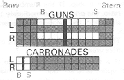
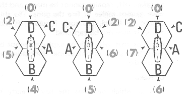
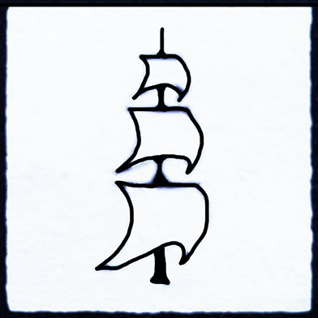
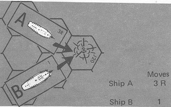
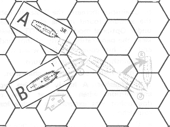
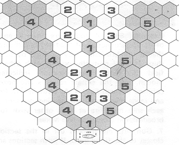
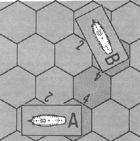
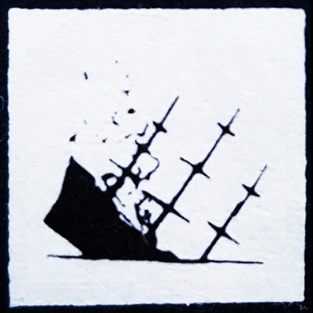

Advanced Game Rules
===================

I. Introduction
---------------

Upon mastering the Basic Game rules, players may wish to advance to a
more realistic and complex version. The Advanced Game offers just that
with a set of rules which can easily be incorporated into the Basic
Game.

All Basic Game rules apply to the Advanced Game unless stated otherwise.

### A. Advanced Game Tables

The Advanced Tables card contains the set of tables to be used in the
Advanced Game. Several of the Basic Game tables have been modified for
the Advanced Game and adjustments in play must be made for this. New
tables have been added and their functions will be explained in the
appropriate section of the rules.

1.  *HDT Modifications:*

    a.  *Rake:* If a ship is raking, cross-index the range of the target
        with the number of guns firing on the range table. The number in
        parenthesis determines which Hit Table is to be used.

    b.  *Stern Rake:* A bonus of +1 is added to a rake any time it is
        fired at a ship's stern.

2.  *Hit Tables:*

    a.  The number of hit tables has been increased by two to Hit Table
        No. 10 in both the hull and rigging sections. If a firing ship's
        Hit Table has been modified to a value greater than ten, resolve
        the attack as separate die rolls. Each die roll must be made on
        the highest table possible. (Example: The greatest modification
        for a firing ship is 20. This would allow the ship to fire twice
        on Hit Table 10 only and not in any other combination.)

    b.  In each Hit Table, the 6 results are marked with an asterisk.
        These indicate a possible critical hit.

        1.  If a 6 is rolled on any Hit Table, roll the die again adding
            the Hit Table number to the result. Index this value with
            the target aspect, (either hull or rigging), on the Critical
            Hit Table found on the inside back cover of the manual.

        2.  Any Critical Hit damage acquired is applied after all other
            damage has been recorded at the end of the Combat Phase.

        3.  All critical hit damage is cumulative.

        4.  Some results are a function of one or more of the Optional
            rules. Those players not using the appropriate Optional
            rule, must ignore the result taking a "no effect" instead.

### B. Log Modifications

1.  The number of hull squares is increased to one and a half times the
    Basic Game value (rounded up). Gun, carronade, and crew values are
    twice as large as the Basic Game values. These changes are made
    while completing the log.

2.  Each broadside and carronade section is sub-divided equally into a
    bow and stern section.

    

II. Sequence of Play
--------------------

The expanded sequence of play is presented and should be followed in
exact order. Each turn is composed of ten phases of play:

A.  **Wind Phase:** *Roll one die to determine wind change, and if so,
    how it will change. This is done every third turn.*

B.  **Unfouling Phase:** Make attempts to unfoul ships which were fouled
    on previous moves. Roll for sinking or exploding ships.

C.  **Movement Notation Phase:** Movement is plotted secretly by all
    players on their ships "logs". Anchoring, up-anchoring, and cutting
    anchors orders are written in the Notes section of "log".

D.  **Movement Execution Phase:** Each ship is moved exactly as ordered
    in the "log". Retrace any possible collisions one hex at a time.
    Check for fouling.

E.  **Grappling and Ungrappling Phase:** Attempt to grapple, avoid
    grappling, or ungrapple.

F.  **Boarding Preparation Phase:** Write any boarding parties in the
    "logs" of the involved ships.

G.  **Combat Phase:** Resolve all firing, and mark all hits in the
    "logs".  Determine if certain ships are to sink or explode.

H.  **Melee Phase:** Resolve melee.

I.  **Load Phase:** Reload broadsides -- a variety of ammunition may now
    be used. Mark any repairs in notes section of the "log"; erase
    applicable squares if repairs are completed.

J.  **Full Sail Phase:** *Place or remove full sail counters on ships.*

III. Wind Phase
---------------

Wind is no longer a constant factor in the game. Changes may occur in
both direction and velocity.

### A. Wind Numbers

Each scenario lists an initial *wind direction* number that indicates
the direction in which the wind is blowing at the start of the game, a
*wind velocity* number that represents the strength at which the wind is
blowing, and a *wind change* number that determines any possible shift
in wind direction and/or velocity.

1.  The initial wind direction is recorded by moving the wind marker to
    the stated direction number on the wind direction hex.

2.  The wind velocity is determined by checking the wind velocity number
    and indexing it with the proper velocity. There are eight types of
    velocity located in the Wind Effects Table. Each type has a
    corresponding wind velocity number: (0) becalmed, (1) light breeze,
    (2) moderate breeze, (3) normal breeze, (4) heavy breeze, (5) gale,
    (6) storm and (7) hurricane.

3.  Wind change is determined in the wind phase of every third turn,
    i.e., turn three, six, nine, etc., by rolling a single die. If the
    number rolled equals or exceeds the wind change number, the wind
    changes as follows:

    a.  A die is rolled again and the Wind Direction Changes Table is
        consulted. The wind arrow counter is then shifted as directed by
        this table.

    b.  A die is rolled a third time and the Wind Velocity Changes Table
        is consulted. The velocity is shifted a step if applicable.

    c.  If the wind velocity should increase a step from storm force to
        hurricane force, the game ends immediately. If the wind velocity
        should drop a step from light breeze force, all ships are
        becalmed and no movement other than turning in place is allowed
        until the wind velocity increases. Velocity cannot be reduce to
        less than zero.

    d.  NOTE: Wind Velocity affects not only movement but full sail and
        fire capabilities of certain ships. These exceptions are noted
        underneath the Wind Effects Table.

### B. Wind Effects

1.  Wind Direction: Same effect as in the Basic Game.

2.  Wind Velocity: The Wind Effects Table reflects the effects of
    different wind velocities upon various size ships. The Table
    compares the wind velocities to the class number of ship. Each class
    number is divided into an additional four columns; A, B, C, and D
    representing the four attitudes to wind. To determine the effect of
    wind velocity on a ship, cross index the velocity to the ship class
    number and wind attitude. The result is then subtracted from the
    ship's movement allowance which becomes the new movement allowance
    for that turn. No allowance can be reduced to less than zero.
    (Example: A ship of 74 guns sailing with battle sails in B attitude
    to a wind of gale force, has a movement allowance
    of 2. Cross-indexing the class 2 B column with the gale row in the
    Wind Effects Table, a result of --1 is found. Subtracting 1 from its
    movement allowance of 2, the ship has a readjusted allowance of 1
    for this turn). Although placed in the Advanced Game for
    convenience, this may be used as an Optional rule if desired.

IV. Unfouling Phase
-------------------

This phase remains the same as in the Basic Game.

V. Movement Notation Phase
--------------------------

There are several additions and changes to this phase.

### A. Full Sails

Full sails allow ships to increase their movement allowance by setting
more sails than normally used in battle.

1.  Like battle sail speed, each ship has a *full sail* speed that is
    given on each ship's counter. There are three full sail speeds: 5,
    6, and 7. The following diagrams give a ship's movement allowance at
    full sail in relation to wind attitudes:

    

2.  Note in each ship's log each full sail movement allowance per
    attitude.

3.  All rigging hits scored on full sail ships are doubled.

4.  Any ship which loses the entire first section of rigging immediately
    removes his ship from full sail status. It may not use full sails
    for the remainder of the game unless it repairs its rigging so as to
    regain at least one rigging square in the first section. (See
    *Advanced Game X.B*).

5.  A ship sets sail to full sail speed by placing a full sail marker on
    his ship. The procedure for placing and removing full sail counters
    is explained in Section XI of the Advanced Game.  A player does not
    have to note full sails in the "log".

    {width=7%}

### B. Backing Sails

Ships that wish to stay in place for part of the movement execution
phase may use the notation "B" (for "backing sails") in the moves column
of the "log". The use of backing sails is important when trying to avoid
collisions. Backing sails may be used in any part of the movement
plot. For each movement factor of the movement allowance that a ship
expends staying in place, a "B" must be written. Example: Two ships A
and B have both been noted to move into the same hex:

A collision would occur in hex J20. If ship B had used the backing sails
rule it could amend its movement plot to Moves "B B B 1". Thus it would
enter hex J20 on the last move of the phase thereby avoiding ship A
which by that time had already passed through the hex. Note that each B
written is equivalent to one movement factor expended.

### C. Anchors

During the Movement Notation Phase, players may decide to anchor their
ships by making the appropriate notation in the notes column of the
ship's log. The advantage to anchoring is that it improves the firing
accuracy as a result of the steadier fire maintained from a more stable
position. This rule may only be used in certain scenarios which will be
so designated.

1.  There are three types of anchoring: *Ordinary anchoring*, written
    "A"; *anchored by bow*, written "AB"; and *anchored by stern*,
    written "AS". A ship may not be simultaneously anchored by more than
    one type of anchoring.

2.  Anchoring does not go into effect the turn of noting it on the
    "log", but the following turn. Ships may write their movement plot
    and continue operating normally the turn they decide to anchor. The
    following turn though, the ship must stop at anchor. Ordinary
    anchored ships may not move or turn in place.

3.  Ships may also be anchored by "springs". This was a system of cables
    attached to the anchors which enabled a ship to be turned while at
    anchor. A ship can anchor on "springs" by making notations of either
    "AS" (anchored by the stern), or "AB" (anchored by the bow). A ship
    anchored by its stern will pivot on its stern hex when turning,
    while a ship anchored by its bow will pivot on its bow hex when
    turning.

4.  Ships on springs can be turned up to 120 degrees left or right
    during the movement execution phase. Ships being turned on springs
    cannot reload or fire during that phase, although repairs can be
    made and melees fought.

5.  The effect of anchoring on firing is found in the Advanced modifiers
    of the HDT.

6.  A ship can up-anchor by writing the symbol "(A)" in the notes column
    of the "log" for two consecutive turns. On the turn following the
    completion of this, the ship can resume normal maneuvering. During
    the two turns that a ship is up-anchoring, she cannot load or fire
    her guns, make repairs, or engage in melees. A ship is not
    considered anchored while up-anchoring.

7.  A ship can cut anchors by writing "a" in the notes column of the
    "log". The turn following this notation, the ship can resume normal
    maneuvering. Once a ship has cut its anchors, it cannot be anchored
    again.

### D. Turning

Ships which did not move from their bow hex during the previous movement
execution phase are limited in their movement by the following
restrictions:

1.  They must move at least one hex straight ahead before they may turn;
    or they may turn in place 60 degrees but can make no other movement.

2.  They lose one turning factor of their turning allowance.

3.  They may increase sail to full sail speed only if they move at least
    one hex in a straight line in the movement execution phase. No
    turning is allowed at any time during the move.

VI. Movement Execution Phase
----------------------------

This phase is identical to that of the Basic Game.

VII. Boarding Preparation Phase
-------------------------------

This phase is identical to that of the Basic Game.

VIII. Combat Phase
------------------

This phase is conducted in the same manner as the Combat Phase in the
Basic Game. However, each broadside must fire in a reduced
field-of-fire, but may use additional types of ammunition.

### A. Reduced Field-of-Fire

The ship's field of fire in the Basic Game was simplified for the sake
of playability. Ships actually had a more limited field at which a full
broadside could be trained at a target, although certain sections could
fire at targets outside of this field.

1.  The play of guns is divided into 5 fields, numbered 1 through 5:

    

2.  Fields 1, 2, and 3 cover hexes that can be hit by the entire
    broadside. Field 4 can be fired at only by the guns of the stern
    section. Field 5 can be fired at only by the guns of the bow
    section. (See *Advanced Game I.B.2*).

3.  A ship may never fire at more than one target with a broadside even
    if just a section of the broadside is fired.

4.  If only one section fires in an initial broadside, it is treated as
    if the entire initial broadside has been fired and the other section
    loses the advantage.

5.  Blocked Fields of Fire

    a.  If a ship fires at a target that lies within the field of the
        entire broadside, i.e., fields 1, 2, or 3, the ship must fire at
        the closest target as explained in the Basic Game.

    b.  Ships cannot fire the stern section at a target in field 4 if
        there is a closer target in field 2 or 4. Ships may fire at a
        target in 4 if there are closer targets occupying fields 1, 3,
        and 5.

    c.  Ships cannot fire the bow section at a target in field 5 if
        there is a closer target in field 3 or 5. Ships may fire at a
        target in field 5 if there are closer targets occupying fields
        1, 2, or 4.

    d.  NOTE: In many cases a ship will straddle two fields. For the
        purpose of determining fire, that ship occupies the lowest
        numbered field. For the purpose of determining line of sight,
        that ship occupies both fields. There are two exceptions to this
        rule:

        1.  Ships firing at a target straddling fields 2 and 4 may not
            fire the stern section if there is a closer target occupying
            field 4. It may fire its bow section.

        2.  Ships firing at a target straddling fields 5 and 3 may not
            fire the bow section if there is a closer target occupying
            field 5. It may fire its stern section.

6.  Determination of field-of-fire is made independently of the
    determination of the range between two opposing ships.

    

    **Example:** Ships A and B are firing at each other. Determination
    of field-of-fire indicates that a full broadside may be fired by
    both ships as they mutually occupy each other's field 3. Range
    determination indicates, though, that the closest range is two hexes
    counted through field 4. As both field-of-fire and range must be
    determined independently, each ship may fire at each other with full
    broadsides at a range of two hexes.

7.  Gun hits are marked off in the section closest to the firing guns.
    If both sections are equidistant, then the defender chooses which
    gun squares are lost. If there are no guns left in that broadside
    hits are marked off on any unmarked gun squares of the defender's
    choice. This includes carronades.

### B. Types of Ammunition

Roundshot was not the only type of ammunition used on ship. Others were
developed to cause different types of damage. Each had certain
advantages and disadvantages. This rule covers several other types of
ammunition and their capabilities as regards range, effectiveness, and
loading times.

1.  *Roundshot*: As roundshot is the only type of ammunition used in the
    Basic Game, there is no change in its use in the Advanced Game.

    a.  The range of roundshot is still ten hexes.

    b.  Roundshot does not modify the Hit Tables.

    c.  One broadside may be loaded with roundshot in one turn.

2.  *Chainshot*: This type of ammunition was used to destroy rigging in
    order to immobilize enemy vessels.

    a.  Chainshot has a maximum range of three hexes.

    b.  Chainshot increases the Basic Hit Table by the amount found in
        the chainshot section under Optional modifiers of HDT. Chainshot
        lacks the penetrating ability of shot, and "H" and "G" hits
        count as misses when it is used.

    c.  Chainshot is loaded in one turn.

    d.  The British may never fire chainshot.

3.  *Doubleshot*: A highly effective type of ammunition when fired at
    close range, doubleshot was generally a double load of roundshot.

    a.  Doubleshot has a range of just one hex.

    b.  Doubleshot increases the Hit table number by the amount
        indicated in the Optional modifier of the HDT.

    c.  Two moves are required to load doubleshot. "DS" is marked in the
        load section of the ship's log for two consecutive turns.  On
        the turn following this, the doubleshot may be fired. The other
        broadside may not be reloaded during either of the two
        turns. Once a ship has begun loading doubleshot, it is committed
        to firing it.

4.  *Grapeshot*: Grapeshot is used exclusively against the enemy crew.
    Grape was composed of canister or langridge. It was ineffective
    against the ship itself but devastating against exposed crewmen.

    a.  Grapeshot has a range of one hex.

    b.  The Hit Tables are not used with grapeshot. Instead, the
        modified Hit Table number represents the number of crew squares
        destroyed.

    c.  Only one turn is needed to load a broadside with grapeshot.

    d.  Grapeshot cannot be fired against an opposing ship whose crew is
        in the second or later turn of melee with the firing ship.

5.  Loaded ammunition cannot be changed without firing out the first
    type of shot.

6.  Carronades always carry the same type of shot as the regular
    broadside even if the broadside has changed the type of shot before
    the carronades have fired.

7.  If the target ship has a boarding party, it receives an additional
    crew square loss over and above the normal crew loss.

### C. Sink and Explode

If any ship "surrenders by striking" in the Combat Phase, the
possibility that it may sink or explode must be determined.

1.  When all of a ship's hull squares have been marked off, the enemy
    player rolls a die, and the *Destroyed Hull Table* is checked.

2.  If the result indicates the ship "surrenders by striking" handle as
    in the Basic Game.

3.  If the result indicates that the "surrendered" ship will sink, the
    ship does not sink immediately. Continue to roll the die once for
    that ship on each succeeding turn during the Unfouling Phase until a
    "6" is rolled. At that time the ship sinks and is removed from the
    mapboard. Place a sink marker on a ship about to sink.

    {width=7%}

4.  If the result indicates that the "surrendered" ship will explode, it
    does not do so immediately. Continue to roll the die once for that
    ship on each succeeding turn during the Unfouling Phase until a "6"
    is rolled. At that time, the ship explodes, and is removed from the
    mapboard. The force of the exploding ship will damage every other
    ship located in an adjacent hex. This is handled by rolling the die,
    and consulting Hit Table number ten under the Rigging Section. Mark
    this damage on each adjacent ship or ships. Place an explode marker
    on a ship about to explode.

5.  Ships which will explode or sink remain on the mapboard until they
    do so, but can take no further part in the battle. The crew cannot
    be taken off, repairs cannot be made, and the crew cannot melee or
    fire the guns. The ship cannot be sailed, although it will drift
    normally. It may not be captured.

6.  Ships that will sink or explode cannot be "scuttled" so as to sink
    sooner than indicated on the die.

### D. Rake

A ship which occupies the hex directly in front of the target ship's bow
or directly behind the target ship's stern and which may bring its guns
to bear may fire a *rake* even if return fire is possible.

IX. Melee Phase
---------------

The Melee Phase is identical to that of the Basic Game.

X. Reload Phase
---------------

### A. Reloading

One broadside per ship may be reloaded with "R" (roundshot),
"DS" (doubleshot), "CS" (chainshot), or "GS" (grapeshot).

### B. Repairs

Ships which don't load or fire guns, engage in melee, become involved in
a collision, up-anchor, change from full sails to battle sails or
vice-versa or expend any factors of its movement allowance to turn, may
make repairs; provided there are at least two crew sections available.
(The second section need not be complete). All repairs take three turns
(not necessarily in sequence). In three turns, two hull, two rigging, or
two gun squares can be repaired by simply erasing the "X" on the most
recently marked squares. Repairs cannot be made on "surrendered"
ships. Repairs in progress are listed in the Notes section of the ship's
"log", in this phase by writing "RH" for *hull repairs*, "RG" for *gun
repairs*, and "RR" for *rigging repairs*. The third repair of the same
type is circled and the boxes erased. Only one type of repair may be
made per turn.

XI. Full Sail Phase
-------------------

During this phase a player may decide for each ship whether full sails
should be added or dropped. Full sails are added by placing a full sail
marker on the ship. Full sails are dropped by removing the full sails
marker. The effect of this takes place immediately.

{width=7%}
