---
title: |
    | {width=70%}
    | Second Edition -- 1981
    | Reprinted -- 2020
author: |
    | The Avalon Hill Game Company's trademark for its fighting sail game
    | Naval warfare during the age of fighting sail
...

Introduction to Rules
=====================

I. Introduction
---------------

*Wooden Ships and Iron Men* is a tactical simulation of naval warfare
during the great age of sail. The game covers the period from 1776 to
1814 when the great square sail ships-of-the-line dominated the oceans
and the speedy and durable American frigates gave world recognition to
their young parent navy. The game is played by two or more players each
commanding a ship, squadron, or whole fleet! Scenarios depict the famous
naval engagements of the American and French Revolutions and the
Napoleonic Wars. The game is also a kit from which other scenarios or
any fictitious engagement may be designed.

Each counter represents a single ship and covers two hexes of the
mapboard. Orders for movement are written for each ship on a "log".
Ships are then moved simultaneously over the mapboard. Any which foul or
grapple may attempt to form boarding parties to take possession of the
enemy's craft by force. Ships may also fire at the opposing vessels
hoping to reduce them to a state of surrender. Careful maneuvering and
good fleet organization are essential to defeat the enemy and gain
victory.

II. Components
--------------

### A. Game Equipment

1.  Mapboard consisting of two sections which can be joined together in
    a variety of ways to allow more freedom of movement.

2.  Set of die-cut counters.

3.  Advanced Tables Card.

4.  Rules of play and scenario manual.

5.  A "log" pad.

6.  One die.

### B. Mapboard

The 22" by 28" mapboard is the playing surface upon which the ships
are maneuvered. The hexagonal grid printed on the mapboard is used to
determine movement, firing ranges, and the positions of the ships. Each
hex (hexagon) has an identification code, this being used to determine
the initial placement of ships for the various scenarios. The code is
also valuable in checking a ship's movement. Portions of the board are
sometimes used as juttings of land in certain scenarios, and will be
defined as such in the applicable scenario. A wind direction hexagon is
found at the lower lefthand corner. Each edge of the board is labeled by
the wind direction numbers pointing toward it. The four edges are
labeled in clockwise order, 1, 2--3, 4, 5--6.

### C. Unit Counters

Included in the game is a sheet of die-cut counters which represent
ships and markers of various types. These are the playing pieces used in
the game. Each counter has a colored spot amidships to identify it and
act as the ship's colors. Red spots identify British ships; white spots
identify French vessels; gold spots identify Spanish and Venetian ships;
and light blue spots identify the American vessels. Printed on each
counter is information needed to play the game. Examine the examples
below:

{width=5em}

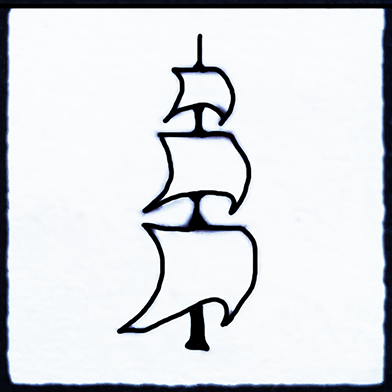{width=5em}

{width=5em}

{width=5em}

{width=5em}

Ship Classes: Each ship overview on the counter represents a class of
ship. Classes denote different sizes and types of ships. NOTE: Care must
be used to match the proper class counter for each ship being played.
The size of a ship is indicated by the size of the class overview.


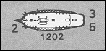


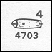


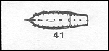

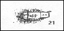


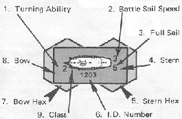

1.  *Turning Ability:* The maximum number of 60 degree turns which that
    ship can make during the course of the Movement Execution Phase.

2.  *Battle Sail Speed*: The maximum speed that a ship has under battle
    sails. (There are two speeds, 3 and 4).

3.  *Full Sail Speed*: The lower righthand number represents a ship's
    movement ability under an increased spread of sail. This speed is
    used in the Advanced Game only.

4.  *Stern*: The stern of a ship is its rear section. This is the blunt
    end of the ship diagram on the counter.

5.  *Stern Hex*: The hex that the stern and the rear half of the ship
    occupies.

6.  *Identification number*: Each counter has a 4 digit number which is
    used to identify it with the ship that it represents. The first
    digit refers to the nationality of the vessel. The second digit
    refers to the class of ship. The last two digits serve to identify
    the counter as separate from any other.

    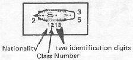

    **Nationality:**\
    1 (Red) = British\
    2 (White) = French\
    3 (Gold) = Spanish/Venetian\
    4 (Light Blue) = American

7.  *Bow Hex*: The hex that the bow and the forward half of the ship
    occupies.

8.  *Bow*: The bow of a ship is its front. This is the pointed end of
    the ship diagram on the counter. The bow always points in the
    direction in which the ship is sailing.

### D. Basic Game and Advanced/Optional Tables

1.  The back of this manual contains the Basic Game Tables necessary for
    the play of the game. Each Table is identified and its use will be
    explained in the appropriate section of rules. Hereafter all Tables
    will be referred to in abbreviated form.

2.  The Advanced/Optional Tables differ from the Basic Game Tables and
    are located on a separate card.

### E. Log Sheet Pad

All the essential information needed for moving and firing ships is
placed here.

III. Prepare For Play
---------------------

### A. Mapboard Set Up

1.  A Scenario is selected from the Scenario section of this manual. All
    information necessary for the set-up is found in the scenario. It is
    better to start with single ship encounters and move on from there
    as experience is gained.

2.  Remove from the counter sheet a counter of proper nationality and
    class for each ship to be played.

3.  Lay the mapboard out and place each ship's bow in the assigned bow
    hex and pointing in the numbered direction corresponding to the wind
    direction hex on the board.

4.  The wind arrow counter is placed in the wind direction hex pointing
    to the proper numbered direction.

5.  If the scenario has any land features involved, the hexes to be
    noted as land will be listed.

### B. Log Sheet

A very important step must now be completed; filling out the log sheet.
A player must fill out a "log" for each ship that he controls. All
information for that ship necessary to the play of the game will be
placed here. This information is found on the ship counter or in the
ship's Order of Battle, found in the scenarios. A diagram is given as
an example of this procedure.

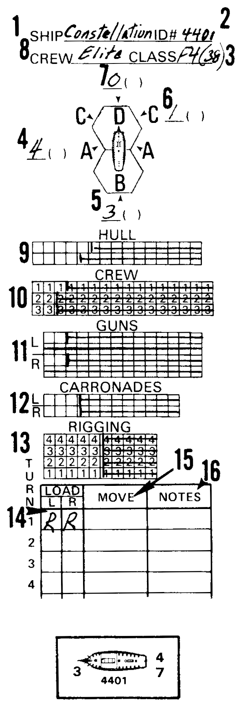{width=20em}

The ship counter and log above represent the starting Basic Game
strength of the Constellation. Check her specifications on the Master
Scenario Chart on Page 27 to ascertain how to correct fill out a ship's
log.


1\.
:   The name of the ship and number of gun carried is placed on line 1.

2\.
:   The identification number of counter to be used for the ship is put
    on line 2.

3\.
:   The Class of ship is placed on line 3. Certain ships may be given a
    specific counter to use in the scenario. This will be indicate by
    giving the I.D. number in this section.

4., 5., 6., and 7\.
:   On lines 4, 5, 6, and 7 place movement allowance for each attitude
    to wind. This information can be found in the Movement section of
    the Basic Game (*Basic Game IV.A.3--4*).

    Ignore parenthesis for Basic Game as these spaces are intended for
    full-sail movement in the Advanced Game.

8\.
:   The quality of crew manning the ship either elite, crack, average,
    green or poor is placed on line 8.

9\.
:   The number of hull squares allotted for each ship is placed in
    section 9. All squares over this number are marked out.

10\.
:   The number of crew squares allotted to each ship is placed in
    section 10. All crew squares are divided into sections. In the Order
    of Battle, the number of sections and number of crew squares per
    section will be given. Each crew section has a corresponding
    numbered row in the "log". Squares not being used should be marked
    out.

11\.
:   The number of gun squares allotted for each ship is placed in
    section 11. This section divides the guns into left and right
    broadsides (labeled L and R). Mark out the gun squares not being
    used.

12\.

:   Section 12 is the Carronade section. This section is completed
    exactly like section 11. Carronades are special guns of limited
    range, hence the reason for separation from section 11.

13\.
:   Section 13 is the Rigging section. Each line of squares represent
    one battle sail speed factor. The number of rigging squares per
    battle sail speed factor is given in the Order of Battle. Squares
    not being used are marked out.

14\.
:   On the movement column (14) of the ship's log, there is a load
    section. It is composed of two spaces, one marked L for left
    broadside; the other R for right broadside. In these spaces the type
    of shot for each broadside is to be marked. There are 4 types of
    shot to be used, roundshot, chainshot, grapeshot, and doubleshot.
    Each has advantages and disadvantages to be discussed later. You can
    load each broadside with one type of shot although both broadsides
    need not have the same type. The spaces in the load column are
    marked: R for roundshot, G for grapeshot, or D for doubleshot. For
    the basic game only roundshot is to be used.

15\.
:   Section 15 denotes the move column. All movement for the ship will
    be placed here. No information is placed here at this time.

16\.
:   The notes section (16) is the part of the moves column where special
    orders and notations are written. These notations will be explained
    in appropriate sections of the rules. No information is placed here
    at this time.

Basic Game Rules
================

I. Introduction
---------------

The Basic Game gives all the information needed to play a scenario in
*Wooden Ships and Iron Men*. Once this section of the rules is
completed, play of the game can begin. Later rule sections include an
Advanced Game and an Optional Rules section which provide more realism
and corresponding complexity. There is even an additional section of
rules which allows players to design their own scenarios.

The rules outline for the Basic Game follows the sequence of play for
each turn.

II. Sequence of Play
--------------------

Once the game has been set up, play begins. The game is played in turns
(representing approximately three minutes). Most scenarios have no limit
to the number of turns contained therein. Each turn is divided into
eight phases. The sequence of play for each turn is as follows:

A.  **Unfouling Phase:** Make attempts to unfoul ships which were fouled
    on previous turns.

B.  **Movement Notation Phase:** Players secretly write in the proposed
    movements for each ship on their log sheets.

C.  **Movement Execution Phase:** When both players have completed their
    log notations, all simultaneously move exactly as their movement was
    written in the log. Retrace any possible collisions one hex at a
    time. if any collisions occur check for fouling.

D.  **Grappling and Ungrappling Phase:** Make all attempts to grapple,
    avoid grappling, and ungrapple.

E.  **Boarding Preparation Phase:** Write any boarding parties in the
    logs of the involved ships.

F.  **Combat Phase:** Resolve all gunfire, and mark all hits on the hit
    boxes of the log sheet.

G.  **Melee Phase:** Resolve all boarding actions, and mark all crew
    hits on the log sheet.

H.  **Load Phase:** Load broadsides.

III. Unfouling Phase
--------------------

Ships which have fouled their rigging (i.e., have entangled their
rigging with that of other ships) on previous moves and have not been
able to unfoul may attempt to unfoul. Ships attempting to unfoul use the
Unfouling Table. Players need not attempt to unfoul if they do not wish
to; however, they may roll one die for each of their ships that is
fouled. If unfouling is successful, both ships that have unfouled may
move normally on that turn. If a ship is fouled with more than one ship,
a player may roll once for each fouled enemy ship.

If after the completion of all unfouling attempts, any ship still
remains fouled to one or more enemy ships, it must wait till next turn
to attempt to unfoul.

Successful Unfouling is noted by writing (F) in the notes section of the
log.

IV. Movement Notation Phase
---------------------------

All ships are moved simultaneously. The move of each ship must be
written secretly in the log before any ship can actually be moved on the
mapboard.

### A. Movement and Turning Allowance

1.  Before writing orders, the movement allowance for each ship must be
    determined. This movement allowance is a combination of a ship's
    battle sail speed and its attitude to the wind direction.

2.  The battle sail speed of each ship is printed on the counter
    adjacent to the stern of the ship diagram (see *Introduction to
    Rules II.C.2*). All ships have a battle sail speed of either 3 or 4.

3.  Along with the battle sail speed the attitude of the ship in
    relation to the wind must be determined. There are four attitudes to
    the wind for each ship, labeled A, B, C, D. Each letter represents a
    different position of the ship in relation to the direction that the
    wind is blowing. See diagram:

    {width=20em}

    {width=20em}

4.  The movement allowance is now checked on one of these two charts:

    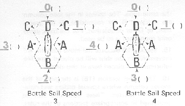

    Examples:

    a.  A ship with a battle sail speed of 3 starts the movement
        notation phase in attitude C in relation to wind direction. Its
        movement allowance is determined to be 1.

    b.  A ship with a battle sail factor of 4 starts the movement
        notation phase in attitude A. Its movement allowance is 4.

5.  The movement allowance is the *maximum* number of *hexes* a ship may
    move in a movement phase. A ship may only move into a hex toward
    which its bow is pointing; i.e., a ship can't move sideways or
    backwards. (Exception: drift -- *Basic Game V.B.1*).
    Each hex a ship's bow enters costs one movement factor of its
    allowance. Once a ship has used all its factors, it must stop.

6.  Movement factors may not be accumulated from one turn to another nor
    may it be transferred between ships.

7.  A ship may use none, some or all of its movement factors available.
    The number of hexes a ship may move is up to the player within the
    limits of its movement allowance.

8.  A ship may make only one 60 degree turn per hex in a movement
    execution phase. A 60 degree turn is equivalent to turning the bow
    to face an adjacent hexside. Since each ship counter occupies
    2 hexes, as a ship's bow is pivoted 60 degrees to point to a new
    hexside, the stern will swing into a new hex.

9.  The turning ability number on the ship counter represents the
    *maximum* number of turns that ship may make in a movement execution
    phase. Remember all ships are limited to just *one turn per hex*, so
    each turn must be made in a different hex. Although it may seem
    impossible for some ships to ever exceed their turning ability
    maximum it does become relevant in the Advanced Game.

10. Each individual turn costs one movement factor of the allowance.
    (*Exception: Basic Game IV.A.15*).

11. A ship may never make a turn if the cost would cause that ship to
    exceed its movement allowance.

12. The movement allowance for each attitude to wind also limits the
    number of hexes a ship may move while in that particular attitude.
    Example: A ship with battle sail factor of 4 starting in attitude A
    has a movement allowance of 4. If it turns to attitude C, it may
    only move one hex in that direction as the movement allowance for
    this attitude is 1. It may turn back to attitude A after moving one
    hex in C and finish its move in A Attitude.

13. Rule 12 does not work both ways. A ship with battle sail speed of 3
    starting her movement turn in Attitude B has a maximum movement
    allowance of 2 even if it moves to attitude A later in the movement
    phase.

14. Rule 12 does not limit the number of turns in any attitude (other
    than the limit of 1 per hex traversed), just the number of hexes
    into which a ship may move.

15. A ship which has a movement allowance of 0 may always turn in place
    60 degrees. This is free.

16. A ship which turns into attitude D must immediately stop and may not
    move or turn for the remainder of the movement phase, even if it has
    movement factors remaining.

17. A ship's movement allowance may never be reduced below 0.

### B. Log Notations

1.  All notations of the move column of the ship's "log". The column
    is divided into numbered sections corresponding to the turns. All
    notations are written in the appropriate turn section.

2.  The number of hexes a ship is to move is written as a number.

3.  Any turns made by the ship are written as an "R" for righthand
    turn of 60 degrees or as an "L" for a lefthand turn of
    60 degrees.

    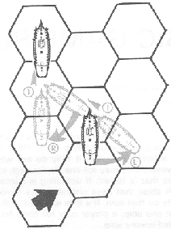

    The ship is at A attitude to the wind and has a battlesail
    speed of 4. Its movement allowance is determined to be 4. The move
    notation in the "log" reads left turn 60°, forward 1 hex,
    right, turn 60°, forward 1 hex. This has completed the ship's full
    allowance. After its first turn into attitude C, the maximum
    distance the ship could move in that direction was one hex. If it
    wished to remain in attitude C, it would have to end its move at
    that point. L1.

4.  Notation must be specific and in the same order as that in which the
    ship will be moved.

5.  After completion of all orders, logs must be opened for inspection
    by the other players. Exception: The load column of the log may
    never be inspected.

6.  Orders must be written for each ship. If a player does not wish a
    ship to move, an "0" will be used as notation.

7.  If a log sheet is incorrectly filled out and/or indicates an illegal
    move for a ship, end that ship's movement at the point of the
    infraction.

8.  Ships which are to enter the game on this turn have their movement
    noted in their "log's" movement column. The first hex entered counts against
    their movement allowance.

V. Movement Execution Phase
---------------------------

### A. Movement

1.  All players move their ships simultaneously on the board.

2.  Ships which are scheduled to enter, enter and move in this phase.

### B. Drifting

This is a special type of movement. It may be voluntary or involuntary.

1.  Whenever the bow hex of a ship does not change or is not plotted to
    change for two consecutive movement execution phases, during the
    second phase the ship will drift one hex in the direction the wind
    is blowing.  Both the bow and the stern must be moved in this
    direction. This applies also to ships which are fouled or grappled
    together, if both ships are on at least their second consecutive
    movement execution phase without moving into another hex. Ships may
    turn in place and still fulfill drifting obligations (see *Basic
    Game IV.A.15*).

2.  Ship of the line class vessels will drift one hex *every other turn*
    while drifting. Frigate and smaller class ships will drift one hex
    per turn while drifting. They will continue these rates until they
    voluntarily move at least one hex.

3.  Ships which are fouled or grappled together cannot move or turn in
    place, they can only drift.

4.  For each turn a ship is to drift, a "D" is written in the move
    column.

5.  Ships which have lost all rigging-squares (become dismasted) drift
    with a special turning allowance.

    a.  Dismasted ships with a turning ability of 1 must wait at least
        three consecutive turns while drifting before being able to make
        a 60 degree turn.

    b.  Dismasted ships with a turning ability of 2 must wait at least
        two consecutive turns while drifting before being able to make a
        60 degree turn.

    c.  Dismasted ships with a turning ability of 3 must wait at least
        one turn while drifting before being able to make a 60 degree
        turn.

    d.  If a dismasted ship makes a 60 degree turn while drifting, it
        must wait the same period before making another turn.

### C. Collision

Ships that cross the course or position other ships (enemy or friendly)
during movement phase may collide with the other ship.

1.  To see if ships have collided, the players must retrace the courses
    of those ships involved one hex at a time. Remember, that a
    60 degree turn counts the same as a hex moved into. If two or more
    ships are found to be in the same hex at the same time in their
    move, a collision takes place.

2.  Only one ship can actually remain in collision hex. If the bow or
    stern of one ship is in the hex at the same point in movement when
    one or more other ships attempt to enter that hex, the ship
    occupying the hex remains. The other ship(s) move back to the
    hex(es) they occupied just prior to the collision. If the stern of a
    ship enters a hex in a turning maneuver at the same point in the
    movement phase as the bow of another ship, the bow enters the hex.
    The turning ship moves back to its previous position. In all other
    cases that might occur, roll a die for each ship involved, and let
    high man decide which ship must occupy the contested hex.

3.  Ships will drift into a new hex on the last move of the phase.

4.  Once a collision has occurred and the position of the collided ships
    have been determined, all movement ends for the ships involved, even
    if their logs have been plotted for further movement. Log notation
    must be changed to correspond with the actual move.

5.  When a collision occurs, the rigging of the involved ships may
    entangle and be fouled, locking the ships together. For each
    collision, one of the involved players must roll a die. The result
    is found on the fouling table, and is implemented immediately. If
    the result is "ships are not fouled", they may continue to move
    normally the next movement phase.

6.  Fouled ships cannot move or turn in place. On the second movement
    phase after fouling they must drift.

7.  Ships that are fouled may perform boarding maneuvers and melee that
    turn and/or any or all subsequent turns that they remain fouled.

8.  The fact that a ship is fouled is indicated in the Notes section of
    the ship's "log" by writing an "F".

VI. Grappling and Ungrappling Phase
-----------------------------------

At the end of the movement execution phase, any ship that occupies a hex
adjacent to a hex occupied by another ship, friendly or unfriendly,
fouled or unfouled, may attempt to grapple.

### A. Grappling

1.  One or both ships may attempt to grapple.

2.  A ship may attempt to grapple, once per turn, each ship to which it
    is adjacent.

3.  If the involved ships are friendly, grappling and ungrappling is
    performed automatically without rolling a die.

4.  If the adjacent ship is unfriendly, an attempt to grapple is made by
    rolling one die and consulting the Grappling Table.

5.  Grappling attempts on the same ship can be made in each turn even if
    previously grappled.

6.  As with fouled ships, grappled ships cannot move or turn in place.
    They can only drift.

7.  Boarding parties can be formed and boarding actions fought between
    grappled ships.

8.  The fact that a ship is grappled is indicated by writing a "G" in
    the notes section of the ship's "log" for each successful
    grapple.

### B. Ungrappling

1.  After all attempts at grappling have been made in this phase, any
    ship which has been successfully grappled may attempt to ungrapple
    by rolling one die and consulting the Ungrappling Table.

2.  A successful ungrapple negates all effects of the grappling. Each
    ungrappled ship may move normally the next turn.

3.  On each turn that a ship is in a grappled state, it may attempt to
    ungrapple. If a ship is grappled more than once, it must ungrapple
    every successful grapple before it is free.

4.  A ship may attempt to ungrapple once per turn each successful
    grapple.

5.  If after completion of all ungrappling attempts, any ship still
    remains grappled to one or more enemy ships, it must wait till next
    turn to attempt to ungrapple.

6.  Ungrappling is indicated by writing a "(G)" in the notes section
    of the ship's log.

VII. Boarding Preparation Phase
-------------------------------

Ships which have been fouled or successfully grappled may form boarding
parties if desired. These parties may attempt to take over an enemy ship
or defend against a take-over in the *melee phase*.

### A. Boarding Party Formation

1.  All boarding parties are formed by crew sections. All available crew
    squares in a crew section must be used.

2.  From one to all sections may be delegated as a boarding party or
    parties as long as the following procedure is maintained:

    a.  The lowest crew section with at least one undestroyed crew
        square must be used first.

    b.  Any remaining crew sections desired as boarding parties must be
        chosen in order. A player may never skip a lower numbered crew
        section to choose a higher numbered crew section as a boarding
        party unless all lower numbered sections have already been
        chosen as such.

### B. Boarding Preparation Procedure

1.  Players secretly write down which crew sections are to be used for
    boarding in the notes section for all ships fouled and/or grappled.
    If the player does not desire to form any boarding parties "NBP"
    is written.

2.  There are three types of boarding parties which may be formed: An
    offensive boarding party written as "OBP" a defensive boarding
    party written as "DBP", and a transfer boarding party written as
    "TBP". (These abbreviations will be used to denote the boarding
    party types hereafter in the rules). An "OBP" must melee in the
    Melee Phase. A "DBP" will melee only if attacked by an opposing
    "OBP". A "TBP" is used only for transfer of crews between
    friendly ships.

3.  To form a boarding party, the abbreviation for the type of boarding
    party desired is written in the Notes section plus each crew section
    number involved. More than one type boarding party may be formed per
    ship.

4.  If there are several ships to which a boarding party could board at
    the same time, the "log" notation should also indicate the ship(s)
    to be boarded.

5.  If all crew sections of a ship are used for boarding parties, that
    ship may not fire at all in the Combat Phase, or move in the next
    Movement Phase.

6.  Transfer of crews is allowed to any friendly adjacent ship, not
    necessarily one fouled or grappled.

7.  Transferred crews may not be used for melee or other purposes until
    the turn following the transfer. This applies even when the ship
    they are transferred to is engaged in melee during the turn of
    transfer.

8.  "TBP's" may be formed to board ships which one thinks will
    surrender. If, for any reason the ship does not surrender, no
    transfer is made and the crew section(s) involved may not be used in
    any other function for that turn.

VIII. Combat Phase
------------------

In this phase, ships may fire at enemy ships in their field of fire and
within range. Firing is considered simultaneous and all firing is
considered completed before results of combat are marked on the "log"
sheets. Firing is done by broadsides of cannon.

### A. Fire Determination

1.  Each ship has a right and left (in Naval terminology, starboard and
    port) broadside. These broadsides are effective only from their side
    of the ship. Each broadside has a "play" or area over which its
    broadside firepower is effective. The play of each broadside is
    shown on the following diagram:

    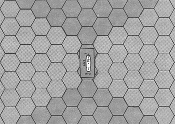

2.  Each ship also has two fields of fire; one for each broadside. Any
    blocking of one field, has no effect, whatsoever, on the other field
    of fire.

3.  The field of fire of each broadside is the area covered by the play
    of the broadside up to the limit of the ten hex firing range.

4.  A ship may fire at a single enemy ship in a broadside's field of
    fire subject to two conditions:

    a.  The ship being fired upon must be the closest in number of hexes
        to the firing ship of all ships in the field of fire;

    b.  If the "closest ship" happens to be a land hex, friendly ship,
        surrendered or captured ship, or a hulk, the field of fire is
        blocked and the ship may not fire that broadside in that turn.

5.  If there is more than one ship or obstacle which qualifies as
    "closest ship", the attacker may choose which is closest and fire
    at that ship.

6.  Firing is noted on the log by drawing a slant line ("/") through
    the last loading notation "R" on the broadside fired.

7.  As firing is considered simultaneous, it may be carried out in any
    order. Hits will not be marked until after all firing is completed.

8.  A ship may fire both broadsides during the same combat phase, if
    both sides are loaded.

9.  Carronades are a special type of gun. They can only be fired at
    ships within the two hex range. Carronade gun squares are added to
    the regular broadside capability.

### B. Fire Procedure

1.  Count the number of hexes to the target by the shortest possible
    route. It may be to either the bow or stern hex, whichever is
    closest. This is the *range*.

2.  In the gun section of the firing ship's "log", count the number
    of guns squares on the broadside firing. Do not include damaged gun
    squares in this count. Also, do not include carronade squares unless
    the range is two hexes or less.

3.  Consult the range tables of the *Hit Determination Table* (HDT),
    cross gridding the number of gun squares firing with the range in
    hexes.  The number found in this table is the number of the Hit
    Table to be used.

4.  Check the HDT modifiers (ignore the advanced modifiers). These are
    variables that will increase or decrease the Hit Table. All
    modifiers are cumulative. If, after using all modifiers that apply,
    Table Zero or above has not been reached, the result is an automatic
    "miss". If a table number higher than eight has been reached, use
    Table Eight, as this is the highest allowed.

5.  The player firing now decides if the fire is to be aimed at the
    hull, or at the rigging. If the range is six hexes or more, the fire
    must be aimed at the rigging.

6.  Consult the correct Hit Table, as determined in steps (3) and (4),
    in either the Hull or Rigging Effects Section, depending on the
    decision made in step (5), then roll one die. Crossgrid the number
    rolled with the proper Hit Table. The result gives the number and
    types of hits scored on the target.

7.  There are four types of hits: H (Hull), G (Gun), C (Crew), and
    R (Rigging). At the end of the Combat Phase, the number and type of
    hits are marked off in the appropriate sections of the target
    ship's "log". Players may wish to keep track of these hits on a
    side sheet of paper until the end of the phase.

8.  Grappled and/or fouled ships may not fire at each other's rigging.

### C. Hit Table Modifiers

1.  *Crew quality:* Crew quality will increase or decrease the BHT as
    shown in the HDT depending on the number of gun squares being fired.

2.  *Raking:* Raking (i.e., when one ship is in position to fire down
    the length of another one), will increase the BHT as shown in the
    HDT, depending on the number of gun squares firing. A ship is in a
    raking position anytime an opposing ship lies within the play of its
    broadside, but it lies outside the play of the opposing broadside.

3.  *Crew Losses:* For each complete crew section wiped out or used
    for boarding, the Hit Table is decreased by one. If no crew sections
    are available for firing, the guns may not be fired.

4.  *Initial Broadside:* The first time a ship fires a broadside, that
    broadside will be the most carefully loaded and aimed that it will
    fire. Each ship has two initial broadsides, one for each side of the
    ship. The initial broadside will increase the Hit Table as shown on
    the HDT, depending on the number of gun squares being fired in the
    broadside.

5.  *Captured Ship:* When using the guns of a captured ship, the Hit
    Table is decreased by two tables. Ignore the crew loss modifier when
    firing from a captured ship.

### D. Marking Hits and the Effects of Damage

Hits are marked on the "log" of the target ship with an "X". The
"log" has four major parts, each part corresponding to a type of hit
on the Hit Table.

1.  Hull Hits ("H"):

    a.  Mark off one hull square per hull hit called for on the Hit
        Tables.

    b.  When all of a ship's hull squares have been marked off, that
        ship will "surrender by striking her colors". The ship is
        considered to be in such danger of sinking that it cannot be
        sailed or the guns worked for the remainder of the game (even by
        a prize crew). None of the original crew can be removed from the
        ship (all are required to try to keep the ship afloat). Neither
        side is allowed to fire on a "struck" ship, although it can be
        boarded. Excess hull hits are treated as "misses". The crew of
        a "surrender by striking" ship cannot participate in melees
        even if boarding parties have been formed. Place a strike marker
        on a ship which has "struck".

        {width=7%}

2.  Crew Hits ("C"):

    a.  Mark off one crew square per crew hit called for on the Hit
        Tables. All crew hits must be taken out of the first section
        until all of its crew squares are gone, then from the second
        section, and finally from the third section.

    b.  When all crew squares on a ship are marked off, the ship cannot
        be moved or be used in combat until more crew squares are put on
        board. Excess crew hits are treated as "misses".

3.  Gun Hits ("G"):

    a.  Mark off one gun square per gun hit called for on the Hit
        Tables. When a gun hit is called for, and the ship has carronade
        squares available, the commander of the *hit* ship can mark off
        whichever type he chooses. Hits should be marked off the side
        closest to the firing ship, although if gun squares on the
        closer side are all marked off, gun squares on the opposite side
        are marked off. If, as in a rake, both sides of the target ship
        are equidistant to the firing ship, the *target* ship chooses
        which gun squares to mark off.

    b.  If all gun squares are marked off, and no friendly ship of the
        same or larger class as the firing ship is within ten squares
        distance, the ship will surrender to the first enemy ship that
        can move into an adjacent hex and fire a broadside into it. The
        ten hex range is determined at the moment the broadside is
        fired. This is known as "surrender by firepower". Excess gun
        hits are treated as hull hits.

4.  Rigging Hits ("R"):

    a.  Mark off one rigging square per rigging hit called for on the
        Hit Tables. The rigging squares are divided into either three
        sections (for ships with a battle sail speed of 3) or four
        sections (for ships with a battle sail speed of 4). All rigging
        hits are taken out of the first section until all rigging
        squares are gone there, then out of the second section, etc.
        Each complete rigging section marked off drops the ship's
        movement allowance by one hex in all attitudes to the wind. When
        all rigging sections are gone, the ship cannot move.

    b.  If all rigging squares are marked off, and no friendly ship of
        the same or larger class as the firing ship is within ten
        squares distance, the ship will surrender to the first enemy
        ship which can rake its hull. This is known as "surrender by
        immobility". Excess rigging hits are treated as "misses".

IX. Melee Phase
---------------

All ships which have not "surrendered" and have crew squares remaining
in their boarding parties may now attempt to capture opposing ships, to
defend themselves and/or to transfer to friendly ships. To determine the
success of the boarding, melee must occur with the enemy's "OBP" or
"DBP". Melee is fought simultaneously *once* per turn.

### A. Transfer Procedure

1.  Crew sections designated as "TBP" during the Boarding Preparation
    Phase may now transfer as ordered to any friendly adjacent ship.

2.  Cross off the transferred crewsections on the "log" as if they
    were casualties, and make a note on a separate sheet of paper of the
    strengths of the transferred crew sections, and their present
    locations. Friendly crews ordered to transfer to ships which have
    "surrendered" in the Combat Phase may not transfer.

3.  If crew sections are transferring to ships which have lost crew
    squares, they may permanently transfer by erasing one crew square
    for each square being transferred. Start erasing with the most
    recent crew square casualty and work back.

4.  Crew sections transferred to a ship immediately assume the quality
    of the original crew. If a crew section is being transferred to a
    ship involved in melee, the crew may not participate in the melee
    nor return to the original ship, and surrenders with the rest of the
    non-meleeing crew if the ship surrenders in that turn.

### B. Boarding Procedure

1.  Ships which have formed "OBP's" during the Boarding Preparation
    Phase must now attempt to have their "OBP's" board and capture by
    melee the opposing enemy ships to which they have been ordered. Only
    "OBP's" initiate melee.

2.  If two opposing ships are simultaneously sending "OBP's" to
    capture each other, both parties must melee.

3.  If one of the opposing ships has ordered a "DBP", melee occurs if
    she is attacked by an "OBP". If the other ship has a "DBP",
    "TBP", or "NBP" then no melee occurs.

4.  If an "OBP" (not "DBP") boards a ship which has ordered a
    "NBP" or "TBP" only, that "OBP" automatically captures the
    ship without melee. The "TBP" would effect its transfer
    simultaneously.

5.  If several "OBP's" are boarding the same ship, their total melee
    strengths are added together.

6.  If an "OBP" is ordered to board a ship which has ordered both an
    "OBP" and a "DBP", the two "OBP's" must melee first. If
    victorious the "OBP" must continue melee with the "DBP".

7.  If an enemy ship "surrenders" during the Combat Phase, an "OBP"
    intended for that ship may go aboard to act as prize crew.

### C. Melee Procedure

1.  Each crew square involved in a melee is worth a certain number of
    melee factors dependent on the ship's crew quality. The number of
    combat factors each crew square is worth is given on the Crew Melee
    Strength Table. Each side multiplies the number of crew squares in
    the melee times the number of combat factors per crew square to find
    the *Total Melee Strength (TMS)* in the melee.

2.  Melee is conducted simultaneously, each player rolling one die and
    consulting the Melee Resolution Table. The number rolled on the die
    is cross-gridded with his TMS. The result is the number of enemy
    crew squares to be marked off on the lowest crew section of the
    boarding party.

3.  Once casualties have been removed, both players refigure their total
    number of surviving crew squares are recompute their TMS.  Another
    melee *round* is fought.  This continues for three *rounds* or until
    one side has a three-to-one or better advantage in TMS.  When a
    three-to-one advantage occurs, the enemy boarding party is defeated
    and all its surviving crew squares become prisoners.  The defeated
    ship must surrender.  The victorious OBP is now considered to be on
    the deck of the ship the enemy boarding party came from.  The ship
    is captured; and all other enemy crew squares on board also become
    prisoners.

4.  Melee once initiated must continue until one ship surrenders, ships
    become ungrappled or unfouled, or both sides disengage by mutual
    consent. If after three rounds no conclusion is reached, melee must
    continue the next turn.

5.  Crew sections already engaged in melee may not quit until one of the
    conditions in 4 above has been met. New crew sections may be added
    to the melee each *turn* if available.

6.  A victorious "DBP" has the option of boarding the opposing ship.
    When the "DBP" boards it automatically changes status to "OBP"
    and must continue melee for the remaining rounds if necessary.

7.  If two different crews are combined in melee, the controlling player
    selects where losses are taken.

### D. Capturing Procedure

1.  Any ship which surrenders in any of four ways either by
    "striking", "firepower", "melee" or "immobility" may be
    captured.

2.  A ship which surrenders by melee is automatically captured by the
    victorious boarding party which is considered to be on the deck of
    the ship the enemy boarding party came from. It now becomes the
    prize crew.

3.  A ship which surrenders by any other means is captured when either a
    "TBP" or "OBP" is placed aboard. The boarding party becomes the
    prize crew (see *Basic Game VII.B.8*).

4.  Surrendered ships may not fire their guns, melee, or move as long as
    they are surrendered.

5.  A prize crew runs the ship normally while on board. They can sail
    the ship, engage in melees, and fire and load the guns (but at two
    tables less than normal).

6.  Once a ship is captured, the victorious player opens a new column on
    his "log" sheet for the captured ship, copying all information
    (including damage) from the old enemy "log".

7.  The original crew is still marked on the ship's crew section of the
    "log". The prize crew is kept on a separate sheet of paper.

8.  If for any reason a prize crew leaves, or is eliminated, the ship
    returns to the control of the original owner.

9.  At least one crew square of the prize crew is required for every six
    prisoner crew squares on a ship. If the numbers fall below this
    ratio, the prisoners immediately take over the ship, and the prize
    crew becomes prisoners.

10. The captured ship assumes the quality of the prize crew.

11. If a ship with a prize crew on board is fired upon, take all "odd"
    crew square losses (i.e., the first, third, fifth, etc. losses) that
    occurs in a Combat Phase from the prize crew and all "even" losses
    from the prisoners. Remember that ships with all hull squares marked
    out cannot be fired upon.

12. Ships which have "surrendered by striking" may never fire their
    guns nor sail even if captured. The prize crew can melee.

13. Ships that surrender automatically become friendly.

14. If at any time a ship which has surrendered other than by striking
    is within five hexes (inclusive) of a friendly ship at the beginning
    of the turn, it ceases to be surrendered and may begin normal
    functions the next turn. It does not lose any of its damage though.
    It is still subject to surrender if the necessary conditions occur
    again.

X. Loading Phase
----------------

Ships should have their broadsides loaded in the beginning of the
scenario. Reloading of fired broadsides takes place in the last phase of
the turn.

A.  A ship can load one complete broadside per turn. Only one side can
    be loaded, not both.

B.  A broadside can be loaded in the same turn that it is fired, and
    fired again during the following turn, or any later turn. Thus it is
    possible for the same broadside to be fired every turn.

C.  In the Basic Game only roundshot may be fired. Reloading is
    indicated in the "log" by writing the letter "R" under the "R"
    or "L" column of the load section at the appropriate turn number.

D.  A broadside may be fired even if there are no targets, but the
    advantage of initial broadside is lost.

XI. Victory Conditions
----------------------

Victory conditions depend upon the scenario. Any special conditions will
be written in the appropriate scenario. General victory conditions will
be split into two categories -- those for single ship scenarios and
those for multi-ship scenarios.

### A. Single Ship Victory Conditions

Single ship scenarios end when one ship "surrenders". The other player
is the victor. There is no time limit for this. Other situations that
qualify are printed below:

1.  If a player refuses to have combat and continually moves his ship
    out of the enemy's ship's range, he is considered the loser. This is
    not an explicit rule so some intelligence must be used to implement
    it. Its function is to keep partially damaged ships from attempting
    to draw by avoiding victory conditions.

2.  If both ships "surrender" simultaneously, it is a draw.

3.  Loss of all crew squares will automatically end the game with
    victory for the other side, even if that side "strikes".

4.  As soon as the victory conditions are met, the game ends at that
    point; and the turn is not completed.

### B. Multi-Ship Victory Conditions

In Multi-ship scenarios, special victory conditions are printed with the
scenario. Some general rules follow:

1.  Each ship has a point value written in its order of battle.

2.  Ships which strike give the opposing player that ship's point
    value.

3.  Ships which have been captured count twice the value to the opposing
    player.

4.  At the end of the scenario, all points are counted and the player
    with the highest amount is declared the winner.

XII. Miscellaneous
------------------

Except for scenarios where land hexes are present, or where land is
defined as being just off a certain edge of the mapboard, it should be
possible for players to keep from sailing off the mapboard by the
expedient of moving all counters a certain number of hexes in the same
direction. This method maintains the ship's relative positions to one
another.

At other times when all ships have moved to one side of the board, it
will be advantageous to merely lift the now unused half of the board and
place it on the other side of the portion of the board now containing
all vessels.

Advanced Game Rules
===================

I. Introduction
---------------

Upon mastering the Basic Game rules, players may wish to advance to a
more realistic and complex version. The Advanced Game offers just that
with a set of rules which can easily be incorporated into the Basic
Game.

All Basic Game rules apply to the Advanced Game unless stated otherwise.

### A. Advanced Game Tables

The Advanced Tables card contains the set of tables to be used in the
Advanced Game. Several of the Basic Game tables have been modified for
the Advanced Game and adjustments in play must be made for this. New
tables have been added and their functions will be explained in the
appropriate section of the rules.

1.  *HDT Modifications:*

    a.  *Rake:* If a ship is raking, cross-index the range of the target
        with the number of guns firing on the range table. The number in
        parenthesis determines which Hit Table is to be used.

    b.  *Stern Rake:* A bonus of +1 is added to a rake any time it is
        fired at a ship's stern.

2.  *Hit Tables:*

    a.  The number of hit tables has been increased by two to Hit Table
        No. 10 in both the hull and rigging sections. If a firing ship's
        Hit Table has been modified to a value greater than ten, resolve
        the attack as separate die rolls. Each die roll must be made on
        the highest table possible. (Example: The greatest modification
        for a firing ship is 20. This would allow the ship to fire twice
        on Hit Table 10 only and not in any other combination.)

    b.  In each Hit Table, the 6 results are marked with an asterisk.
        These indicate a possible critical hit.

        1.  If a 6 is rolled on any Hit Table, roll the die again adding
            the Hit Table number to the result. Index this value with
            the target aspect, (either hull or rigging), on the Critical
            Hit Table found on the inside back cover of the manual.

        2.  Any Critical Hit damage acquired is applied after all other
            damage has been recorded at the end of the Combat Phase.

        3.  All critical hit damage is cumulative.

        4.  Some results are a function of one or more of the Optional
            rules. Those players not using the appropriate Optional
            rule, must ignore the result taking a "no effect" instead.

### B. Log Modifications

1.  The number of hull squares is increased to one and a half times the
    Basic Game value (rounded up). Gun, carronade, and crew values are
    twice as large as the Basic Game values. These changes are made
    while completing the log.

2.  Each broadside and carronade section is sub-divided equally into a
    bow and stern section.

    

II. Sequence of Play
--------------------

The expanded sequence of play is presented and should be followed in
exact order. Each turn is composed of ten phases of play:

A.  **Wind Phase:** *Roll one die to determine wind change, and if so,
    how it will change. This is done every third turn.*

B.  **Unfouling Phase:** Make attempts to unfoul ships which were fouled
    on previous moves. Roll for sinking or exploding ships.

C.  **Movement Notation Phase:** Movement is plotted secretly by all
    players on their ships "logs". Anchoring, up-anchoring, and cutting
    anchors orders are written in the Notes section of "log".

D.  **Movement Execution Phase:** Each ship is moved exactly as ordered
    in the "log". Retrace any possible collisions one hex at a time.
    Check for fouling.

E.  **Grappling and Ungrappling Phase:** Attempt to grapple, avoid
    grappling, or ungrapple.

F.  **Boarding Preparation Phase:** Write any boarding parties in the
    "logs" of the involved ships.

G.  **Combat Phase:** Resolve all firing, and mark all hits in the
    "logs".  Determine if certain ships are to sink or explode.

H.  **Melee Phase:** Resolve melee.

I.  **Load Phase:** Reload broadsides -- a variety of ammunition may now
    be used. Mark any repairs in notes section of the "log"; erase
    applicable squares if repairs are completed.

J.  **Full Sail Phase:** *Place or remove full sail counters on ships.*

III. Wind Phase
---------------

Wind is no longer a constant factor in the game. Changes may occur in
both direction and velocity.

### A. Wind Numbers

Each scenario lists an initial *wind direction* number that indicates
the direction in which the wind is blowing at the start of the game, a
*wind velocity* number that represents the strength at which the wind is
blowing, and a *wind change* number that determines any possible shift
in wind direction and/or velocity.

1.  The initial wind direction is recorded by moving the wind marker to
    the stated direction number on the wind direction hex.

2.  The wind velocity is determined by checking the wind velocity number
    and indexing it with the proper velocity. There are eight types of
    velocity located in the Wind Effects Table. Each type has a
    corresponding wind velocity number: (0) becalmed, (1) light breeze,
    (2) moderate breeze, (3) normal breeze, (4) heavy breeze, (5) gale,
    (6) storm and (7) hurricane.

3.  Wind change is determined in the wind phase of every third turn,
    i.e., turn three, six, nine, etc., by rolling a single die. If the
    number rolled equals or exceeds the wind change number, the wind
    changes as follows:

    a.  A die is rolled again and the Wind Direction Changes Table is
        consulted. The wind arrow counter is then shifted as directed by
        this table.

    b.  A die is rolled a third time and the Wind Velocity Changes Table
        is consulted. The velocity is shifted a step if applicable.

    c.  If the wind velocity should increase a step from storm force to
        hurricane force, the game ends immediately. If the wind velocity
        should drop a step from light breeze force, all ships are
        becalmed and no movement other than turning in place is allowed
        until the wind velocity increases. Velocity cannot be reduce to
        less than zero.

    d.  NOTE: Wind Velocity affects not only movement but full sail and
        fire capabilities of certain ships. These exceptions are noted
        underneath the Wind Effects Table.

### B. Wind Effects

1.  Wind Direction: Same effect as in the Basic Game.

2.  Wind Velocity: The Wind Effects Table reflects the effects of
    different wind velocities upon various size ships. The Table
    compares the wind velocities to the class number of ship. Each class
    number is divided into an additional four columns; A, B, C, and D
    representing the four attitudes to wind. To determine the effect of
    wind velocity on a ship, cross index the velocity to the ship class
    number and wind attitude. The result is then subtracted from the
    ship's movement allowance which becomes the new movement allowance
    for that turn. No allowance can be reduced to less than zero.
    (Example: A ship of 74 guns sailing with battle sails in B attitude
    to a wind of gale force, has a movement allowance
    of 2. Cross-indexing the class 2 B column with the gale row in the
    Wind Effects Table, a result of --1 is found. Subtracting 1 from its
    movement allowance of 2, the ship has a readjusted allowance of 1
    for this turn). Although placed in the Advanced Game for
    convenience, this may be used as an Optional rule if desired.

IV. Unfouling Phase
-------------------

This phase remains the same as in the Basic Game.

V. Movement Notation Phase
--------------------------

There are several additions and changes to this phase.

### A. Full Sails

Full sails allow ships to increase their movement allowance by setting
more sails than normally used in battle.

1.  Like battle sail speed, each ship has a *full sail* speed that is
    given on each ship's counter. There are three full sail speeds: 5,
    6, and 7. The following diagrams give a ship's movement allowance at
    full sail in relation to wind attitudes:

    

2.  Note in each ship's log each full sail movement allowance per
    attitude.

3.  All rigging hits scored on full sail ships are doubled.

4.  Any ship which loses the entire first section of rigging immediately
    removes his ship from full sail status. It may not use full sails
    for the remainder of the game unless it repairs its rigging so as to
    regain at least one rigging square in the first section. (See
    *Advanced Game X.B*).

5.  A ship sets sail to full sail speed by placing a full sail marker on
    his ship. The procedure for placing and removing full sail counters
    is explained in Section XI of the Advanced Game.  A player does not
    have to note full sails in the "log".

    {width=7%}

### B. Backing Sails

Ships that wish to stay in place for part of the movement execution
phase may use the notation "B" (for "backing sails") in the moves column
of the "log". The use of backing sails is important when trying to avoid
collisions. Backing sails may be used in any part of the movement
plot. For each movement factor of the movement allowance that a ship
expends staying in place, a "B" must be written. Example: Two ships A
and B have both been noted to move into the same hex:

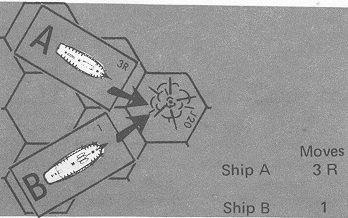

A collision would occur in hex J20. If ship B had used the backing sails
rule it could amend its movement plot to Moves "B B B 1". Thus it would
enter hex J20 on the last move of the phase thereby avoiding ship A
which by that time had already passed through the hex. Note that each B
written is equivalent to one movement factor expended.


### C. Anchors

During the Movement Notation Phase, players may decide to anchor their
ships by making the appropriate notation in the notes column of the
ship's log. The advantage to anchoring is that it improves the firing
accuracy as a result of the steadier fire maintained from a more stable
position. This rule may only be used in certain scenarios which will be
so designated.

1.  There are three types of anchoring: *Ordinary anchoring*, written
    "A"; *anchored by bow*, written "AB"; and *anchored by stern*,
    written "AS". A ship may not be simultaneously anchored by more than
    one type of anchoring.

2.  Anchoring does not go into effect the turn of noting it on the
    "log", but the following turn. Ships may write their movement plot
    and continue operating normally the turn they decide to anchor. The
    following turn though, the ship must stop at anchor. Ordinary
    anchored ships may not move or turn in place.

3.  Ships may also be anchored by "springs". This was a system of cables
    attached to the anchors which enabled a ship to be turned while at
    anchor. A ship can anchor on "springs" by making notations of either
    "AS" (anchored by the stern), or "AB" (anchored by the bow). A ship
    anchored by its stern will pivot on its stern hex when turning,
    while a ship anchored by its bow will pivot on its bow hex when
    turning.

4.  Ships on springs can be turned up to 120 degrees left or right
    during the movement execution phase. Ships being turned on springs
    cannot reload or fire during that phase, although repairs can be
    made and melees fought.

5.  The effect of anchoring on firing is found in the Advanced modifiers
    of the HDT.

6.  A ship can up-anchor by writing the symbol "(A)" in the notes column
    of the "log" for two consecutive turns. On the turn following the
    completion of this, the ship can resume normal maneuvering. During
    the two turns that a ship is up-anchoring, she cannot load or fire
    her guns, make repairs, or engage in melees. A ship is not
    considered anchored while up-anchoring.

7.  A ship can cut anchors by writing "a" in the notes column of the
    "log". The turn following this notation, the ship can resume normal
    maneuvering. Once a ship has cut its anchors, it cannot be anchored
    again.

### D. Turning

Ships which did not move from their bow hex during the previous movement
execution phase are limited in their movement by the following
restrictions:

1.  They must move at least one hex straight ahead before they may turn;
    or they may turn in place 60 degrees but can make no other movement.

2.  They lose one turning factor of their turning allowance.

3.  They may increase sail to full sail speed only if they move at least
    one hex in a straight line in the movement execution phase. No
    turning is allowed at any time during the move.

VI. Movement Execution Phase
----------------------------

This phase is identical to that of the Basic Game.

VII. Boarding Preparation Phase
-------------------------------

This phase is identical to that of the Basic Game.

VIII. Combat Phase
------------------

This phase is conducted in the same manner as the Combat Phase in the
Basic Game. However, each broadside must fire in a reduced
field-of-fire, but may use additional types of ammunition.

### A. Reduced Field-of-Fire

The ship's field of fire in the Basic Game was simplified for the sake
of playability. Ships actually had a more limited field at which a full
broadside could be trained at a target, although certain sections could
fire at targets outside of this field.

1.  The play of guns is divided into 5 fields, numbered 1 through 5:

    

2.  Fields 1, 2, and 3 cover hexes that can be hit by the entire
    broadside. Field 4 can be fired at only by the guns of the stern
    section. Field 5 can be fired at only by the guns of the bow
    section. (See *Advanced Game I.B.2*).

3.  A ship may never fire at more than one target with a broadside even
    if just a section of the broadside is fired.

4.  If only one section fires in an initial broadside, it is treated as
    if the entire initial broadside has been fired and the other section
    loses the advantage.

5.  Blocked Fields of Fire

    a.  If a ship fires at a target that lies within the field of the
        entire broadside, i.e., fields 1, 2, or 3, the ship must fire at
        the closest target as explained in the Basic Game.

    b.  Ships cannot fire the stern section at a target in field 4 if
        there is a closer target in field 2 or 4. Ships may fire at a
        target in 4 if there are closer targets occupying fields 1, 3,
        and 5.

    c.  Ships cannot fire the bow section at a target in field 5 if
        there is a closer target in field 3 or 5. Ships may fire at a
        target in field 5 if there are closer targets occupying fields
        1, 2, or 4.

    d.  NOTE: In many cases a ship will straddle two fields. For the
        purpose of determining fire, that ship occupies the lowest
        numbered field. For the purpose of determining line of sight,
        that ship occupies both fields. There are two exceptions to this
        rule:

        1.  Ships firing at a target straddling fields 2 and 4 may not
            fire the stern section if there is a closer target occupying
            field 4. It may fire its bow section.

        2.  Ships firing at a target straddling fields 5 and 3 may not
            fire the bow section if there is a closer target occupying
            field 5. It may fire its stern section.

6.  Determination of field-of-fire is made independently of the
    determination of the range between two opposing ships.

    

    **Example:** Ships A and B are firing at each other. Determination
    of field-of-fire indicates that a full broadside may be fired by
    both ships as they mutually occupy each other's field 3. Range
    determination indicates, though, that the closest range is two hexes
    counted through field 4. As both field-of-fire and range must be
    determined independently, each ship may fire at each other with full
    broadsides at a range of two hexes.

7.  Gun hits are marked off in the section closest to the firing guns.
    If both sections are equidistant, then the defender chooses which
    gun squares are lost. If there are no guns left in that broadside
    hits are marked off on any unmarked gun squares of the defender's
    choice. This includes carronades.

### B. Types of Ammunition

Roundshot was not the only type of ammunition used on ship. Others were
developed to cause different types of damage. Each had certain
advantages and disadvantages. This rule covers several other types of
ammunition and their capabilities as regards range, effectiveness, and
loading times.

1.  *Roundshot*: As roundshot is the only type of ammunition used in the
    Basic Game, there is no change in its use in the Advanced Game.

    a.  The range of roundshot is still ten hexes.

    b.  Roundshot does not modify the Hit Tables.

    c.  One broadside may be loaded with roundshot in one turn.

2.  *Chainshot*: This type of ammunition was used to destroy rigging in
    order to immobilize enemy vessels.

    a.  Chainshot has a maximum range of three hexes.

    b.  Chainshot increases the Basic Hit Table by the amount found in
        the chainshot section under Optional modifiers of HDT. Chainshot
        lacks the penetrating ability of shot, and "H" and "G" hits
        count as misses when it is used.

    c.  Chainshot is loaded in one turn.

    d.  The British may never fire chainshot.

3.  *Doubleshot*: A highly effective type of ammunition when fired at
    close range, doubleshot was generally a double load of roundshot.

    a.  Doubleshot has a range of just one hex.

    b.  Doubleshot increases the Hit table number by the amount
        indicated in the Optional modifier of the HDT.

    c.  Two moves are required to load doubleshot. "DS" is marked in the
        load section of the ship's log for two consecutive turns.  On
        the turn following this, the doubleshot may be fired. The other
        broadside may not be reloaded during either of the two
        turns. Once a ship has begun loading doubleshot, it is committed
        to firing it.

4.  *Grapeshot*: Grapeshot is used exclusively against the enemy crew.
    Grape was composed of canister or langridge. It was ineffective
    against the ship itself but devastating against exposed crewmen.

    a.  Grapeshot has a range of one hex.

    b.  The Hit Tables are not used with grapeshot. Instead, the
        modified Hit Table number represents the number of crew squares
        destroyed.

    c.  Only one turn is needed to load a broadside with grapeshot.

    d.  Grapeshot cannot be fired against an opposing ship whose crew is
        in the second or later turn of melee with the firing ship.

5.  Loaded ammunition cannot be changed without firing out the first
    type of shot.

6.  Carronades always carry the same type of shot as the regular
    broadside even if the broadside has changed the type of shot before
    the carronades have fired.

7.  If the target ship has a boarding party, it receives an additional
    crew square loss over and above the normal crew loss.

### C. Sink and Explode

If any ship "surrenders by striking" in the Combat Phase, the
possibility that it may sink or explode must be determined.

1.  When all of a ship's hull squares have been marked off, the enemy
    player rolls a die, and the *Destroyed Hull Table* is checked.

2.  If the result indicates the ship "surrenders by striking" handle as
    in the Basic Game.

3.  If the result indicates that the "surrendered" ship will sink, the
    ship does not sink immediately. Continue to roll the die once for
    that ship on each succeeding turn during the Unfouling Phase until a
    "6" is rolled. At that time the ship sinks and is removed from the
    mapboard. Place a sink marker on a ship about to sink.

    {width=7%}

4.  If the result indicates that the "surrendered" ship will explode, it
    does not do so immediately. Continue to roll the die once for that
    ship on each succeeding turn during the Unfouling Phase until a "6"
    is rolled. At that time, the ship explodes, and is removed from the
    mapboard. The force of the exploding ship will damage every other
    ship located in an adjacent hex. This is handled by rolling the die,
    and consulting Hit Table number ten under the Rigging Section. Mark
    this damage on each adjacent ship or ships. Place an explode marker
    on a ship about to explode.

5.  Ships which will explode or sink remain on the mapboard until they
    do so, but can take no further part in the battle. The crew cannot
    be taken off, repairs cannot be made, and the crew cannot melee or
    fire the guns. The ship cannot be sailed, although it will drift
    normally. It may not be captured.

6.  Ships that will sink or explode cannot be "scuttled" so as to sink
    sooner than indicated on the die.

### D. Rake

A ship which occupies the hex directly in front of the target ship's bow
or directly behind the target ship's stern and which may bring its guns
to bear may fire a *rake* even if return fire is possible.

IX. Melee Phase
---------------

The Melee Phase is identical to that of the Basic Game.

X. Reload Phase
---------------

### A. Reloading

One broadside per ship may be reloaded with "R" (roundshot),
"DS" (doubleshot), "CS" (chainshot), or "GS" (grapeshot).

### B. Repairs

Ships which don't load or fire guns, engage in melee, become involved in
a collision, up-anchor, change from full sails to battle sails or
vice-versa or expend any factors of its movement allowance to turn, may
make repairs; provided there are at least two crew sections available.
(The second section need not be complete). All repairs take three turns
(not necessarily in sequence). In three turns, two hull, two rigging, or
two gun squares can be repaired by simply erasing the "X" on the most
recently marked squares. Repairs cannot be made on "surrendered"
ships. Repairs in progress are listed in the Notes section of the ship's
"log", in this phase by writing "RH" for *hull repairs*, "RG" for *gun
repairs*, and "RR" for *rigging repairs*. The third repair of the same
type is circled and the boxes erased. Only one type of repair may be
made per turn.

XI. Full Sail Phase
-------------------

During this phase a player may decide for each ship whether full sails
should be added or dropped. Full sails are added by placing a full sail
marker on the ship. Full sails are dropped by removing the full sails
marker. The effect of this takes place immediately.

{width=7%}

Optional Rules
==============

I. Introduction
---------------

This section offers a set of optional rules that may be added in any
combination to suit the player's taste. Each optional rule adds greater
scope and realism as well as complexity to play of the game.

II. Timed Moves
---------------

To make the game flow more quickly, use a timer to limit the writing of
movement. Allow one minute to write for single-ship actions, two minutes
for up to three ships per side, three minutes for up to six ships per
side, and an additional three minutes for each additional six ships per
side. Ships whose orders do not get written, move on a straight course
their full movement allowance. 1, 2, and 3 minute timers may be
purchased directly from Avalon Hill. Ask for a current Parts List.

III. Multi-Player Communication
-------------------------------

During the age of sail, flags were used to communicate tactics to the
ships of a fleet. This system was inefficient for three major reasons:

1.  It took time to set up the coded message to be sent, delaying
    implementation of important tactics.
2.  In the smoky haze of battle, it was often difficult, if not
    impossible for ships to discern the flags.
3.  This system limited the number and variety of messages which could
    be sent.

To reflect this in multi-player games, the following rules may be used:

A.  Messages between ships of the same fleet may be sent in writing
    only. This is done in the Movement Notation Phase.
B.  Only one message per ship may be sent to the other ships of the
    fleet in that phase.
C.  This option should be used with the "timed moves" option.
D.  Players may also wish to forbid any communications between players
    commanding different squadrons of different nationalities, to
    simulate their difficulties in reading each other's flag signaling
    system.

IV. Command Lag
---------------

The number of ships any flag officer of the period could actually
control effectively was a squadron of six ships (often less). There
would be a considerable "time-lag" between the time an admiral
signaled a squadron not under his immediate control, and the time that
squadron actually carried out his orders.

To simulate this loss of time in games where a single player is
commanding more than one squadron, use the following rules:

1.  A player must select a ship as his flag ship and divide the fleet
    into squadrons of six or less ships.
2.  The player writes the moves for the ships in his immediate squadron
    from turn to turn in the normal manner.
3.  The player writes the moves for the ships in other squadrons three
    turns in advance. Thus, at the start of the game, the player would
    write movement orders for these ships for turns one, two and three.
    After turn one was completed, he would write movement orders for
    these ships for turn four, etc.
4.  Alternatively, all ships completely or partly within ten hexes of
    the flag ship can have their movement written from turn to turn. All
    other ships must have their movement written for three turns in
    advance.
    a.  Ships, which had their movement written for three turns in
        advance, but end their turn within ten hexes of the flag ship,
        can have excess movement orders erased, and can be marked from
        turn to turn.
    b.  Ships which find themselves over ten hexes from the flag ship,
        and which have had their previous movement marked from turn to
        turn, must have their movement marked for three turns in
        advance, the next movement notation phase.
5.  If the flag ship surrenders, any movement for ships in that squadron
    must be marked for the next five turns. After these five turns have
    been completed, the player can designate a new flag ship and begin
    moving normally again.
6.  In multi-player games, each player chooses a flag ship for the
    squadron that he controls.

V. Changing Wind Number
-----------------------

When changing wind direction and wind velocity, a player may roll the
die a fourth time. This new number represents the new wind change
number. It may not be rolled if the wind does not change in velocity or
direction.

VI. Variable Wind Direction and Velocity
----------------------------------------

At the start of any scenario, a player may instead of accepting the
historical wind factors roll a die 3 times for a new wind direction,
wind velocity and wind change number. The new direction would correspond
to the die roll compared to the wind direction hex on the mapboard. The
wind velocity would be the match of the second die roll with the die
roll column of the Wind Velocity Table. The third die roll would be the
wind change number.

VII. Towing
-----------

A. A ship may tow another friendly ship.

B. Ships towing a ship of equal or inferior gun rating lose one hex of
speed in all wind attitudes. Ships towing a ship of superior gun rating
lose two hexes of speed in all wind attitudes.

C. A ship towing another ship in zero movement allowance attitude may
still turn in place as in the Basic Game.

D. Towing Procedure

1\. Maneuver the towing ship so that its stern is in the hex to which the
bow of the ship to be towed is pointing. Indicate in the "log" that
the ships are to be grappled.

2\. The two ships can be maneuvered together on succeeding turns, the
ship being towed moving directly in the wake of the other ship. Only one
movement plot need be written.

3\. Ungrappling notations in the "log" will end the tow.

VIII. Loss of Rigging
---------------------

Although the rigging sections do not correspond exactly on a one-to-one
basis with the masts of a ship, there is a positive correlation between
the fact that a rigging section is lost and the actual material loss of
a mast or part of same. Loss of masts upset the trim of a ship and
caused a less stable firing platform. If a mast fell but did not break
cleanly, the ship would be heeled to an extent that both broadsides were
useless. The following rules allow for masts to effect the play of the
game:

A. A ship with all rigging sections destroyed is -1 HT when firing for
ships having up to 6 gun squares, and -2 HT when firing for ships with 7
or more gun squares.

B. In a phase in which a ship loses one or more entire rigging
section(s), a die is immediately rolled for each section lost and the
following table is consulted:

DIE NUMBER RESULTS

Mast hangs over

the side\*

Mast fails free

2-6

\*Additional Die Roll

1, 3, 5 - left broadside 2, 4, 6 - right broadside

If the mast fails free, the results of the mast loss are the same as the
loss of a rigging section. If the mast hangs over the side, the ship
cannot fire until it has been cut loose. The Unfouling Table is used,
and one die roll per unfouling phase is allowed for attempts to cut the
mast loose. The ship's speed is reduced by one and may not turn until
it is cut loose. Any adjacent ship within the play of the broadside over
which the mast hangs must roll for fouling.

IX. Blocked Wind
----------------

When one ship is adjacent to another and lays directly between its bow
or stern hex and the wind, the sails would tend to "blanket" or block
off the wind to the second ship, thereby slowing it down.

A. If the ship blocking the wind is under full sails, the movement
allowance of the ship blocked is cut by two hexes, for that turn. If the
ship blocking the wind is under battle sails and has at least half its
rigging squares left, the movement allowance of the ship blocked is cut
by one hex for that turn.

B. A smaller ship could not block the wind of a larger ship as
effectively as one the same size.

1\. If a ship blocks the wind to a ship mounting 30 plus guns less than
the blocking ship, the loss of speed, as described in A., is increased
by one, for that turn. The reverse is also true. If a ship is blocking a
ship with 30 plus more guns than that ship, the loss of speed described
in A above is reduced by one for that turn.

2\. If the difference in ratings between the two ships is 60 or more
guns, the loss of speed in A above is varied by two as explained in B
above.

X. Exploding Ships
------------------

As damage caused by exploding ships was a function of the ship's size,
a variable damage effect is herein incorporated. A ship exploding will
cause damage to any adjacent ship on the Rigging Effects Table number
double to her 1 hex range rake bonus, but in no case to exceed table 10.
In addition No. 14 of the Critical Hits Table must be checked for fire
damage.

XI. Running Aground
-------------------

Each ship has a depth value. This value indicates the maximum depth of
water in which that ship will run aground. If a ship enters a hex in
which the water depth is equal or less than its depth value, it has run
aground. The depths of shallow water hexes is given in the appropriate
scenario.

A. When a ship runs aground, it stops all movement and may proceed no
further that turn. Readjust the movement plot of the ship's log to
reflect the actual move.

B. Immediately roll a die. The resulting number indicates the relative
difficulty of refloating the ship. On each succeeding turn during the
reload phase, the die is rolled to see if the ship can be refloated. The
die number rolled must exceed the number initially rolled, or the ship
remains aground for another turn. If a "6" had been rolled initially,
this would indicate that the ship cannot be refloated by ordinary means.

C. Ships that enter land hexes are considered to be destroyed.

D. Ships that are successfully refloated are moved back into the hex
they occupied prior to running aground. They may move normally next
turn.

E. Ships cannot fire their guns while aground.

XII. Casting the Lead
---------------------

Ships often needed to measure depth of uncharted waters through which
they intended to travel. Casting the lead was a method used to determine
this.

A. Players can be assumed to be "casting the lead" for any ships which
have moved a maximum of one hex in that movement phase. On request, the
enemy player must tell the depth of water in all hexes adjacent to their
ship.

B. Ships at anchor which turn 120 degrees have moved either stern or bow
two hexes and cannot be considered to be -casting the lead.\-\--

XIII. Optional Rake Determination
---------------------------------

Ships qualify for raking only when they occupy a hex toward which the
bow or stern of the target ship is pointing.

NOTE: There have been two different rules presented on rake
determination. Each has certain advantages and disadvantages as to its
application in the game system. None are totally accurate in their
definition of rake. While the optional rake may appear to be the most
realistic of the two it can only be applied at set points in time. On
the other hand, the Basic Game rule, though it may not consistently
present actual raking positions, does take into account the continual
movement of ships in real battle.

Players are advised to bear this in mind when choosing which rule to
use.

XIV. Fore and Aft Rigging
-------------------------

Allow ships which have fore and aft rigging (ships which are rigged with
the type sails used by modern sailboats as opposed to the square sails
in general use by warships in this period) to move one hex every second
turn in D attitude to the wind. This rule takes into account the
improved weatherliness of fore-and-aft sails. Ships which carry this
special type of rigging will be stated as such in the scenario. Rigging
hits are not doubled if a fore and aft rigged ship is at full sail.

XV. Special Rules
-----------------

### A. Copper Bottom

Some ships, especially during the Revolutionary period, did not have
copper bottoming. This allowed marine invertebrates to attack to the
hull and reduce the vessel's speed. For those who wish to include this,
the following rule is presented:

All ships designated as being at sea for at least three months and
having no coppering will lose one movement factor of its allowance in
all attitudes under Full Sails.

### B. Scurvy

During the Revolutionary War period, Navies had not learned how to
combat the disease scurvy. They avoided the effect of crew loss due to
this and, other diseases on ships performance by increasing the size of
the crews.

Ships designated as newly arrived on a foreign station or to a fleet
will have one or two extra crew squares per section for the S.O.L. class
ships and one extra crew square per section for frigate class ships.

`\end{multicols}`{=latex}
`\pagebreak`{=latex}
`\begin{multicols}{3}`{=latex}

Basic Game Tables
=================

`\end{multicols}`{=latex}

```{=html}
<style>
    table#basic-hdt td {
        text-align: right
    }

    table#basic-hdt td:first-child {
        text-align: center
    }
</style>

<table id="basic-hdt">
  <caption>Hit Determination Table (HDT)</caption>

  <tr>
    <th rowspan="3">Guns Firing</th>
    <th colspan="6" rowspan="2">Range in hexes</th>
    <th rowspan="8"></th>
    <th colspan="9">Hit table modifiers</th>
    <th rowspan="8"></th>
    <th colspan="5">Optional modifiers</th>
  </tr>

  <tr>
    <th colspan="5">Crew Quality</th>
    <th rowspan="2">Crew Section Loss</th>
    <th rowspan="2">Initial Bdside</th>
    <th rowspan="2">Rake</th>
    <th rowspan="2">Cap Ship</th>
    <th colspan="4">Ammunition</th>
    <th rowspan="2">All types of anchor</th>
  </tr>

  <tr>
    <th>1</th>
    <th>2</th>
    <th>3</th>
    <th>4</th>
    <th style="white-space: nowrap;">5–6</th>
    <th style="white-space: nowrap;">7–10</th>
    <th>EL</th>
    <th>CR</th>
    <th>AV</th>
    <th>GR</th>
    <th>PR</th>
    <th>GP</th>
    <th>CH</th>
    <th>DS</th>
    <th>RS</th>
  </tr>

  <tr>
    <td>1–3</td>
    <td>1</td>
    <td>1</td>
    <td>0</td>
    <td>−1</td>
    <td>−2</td>
    <td>−3</td>
    <td>+1</td>
    <td>+1</td>
    <td>0</td>
    <td>0</td>
    <td>−1</td>
    <td>−1</td>
    <td>+1</td>
    <td>+1</td>
    <td>−2</td>
    <td>−1</td>
    <td>+1</td>
    <td>+1</td>
    <td>0</td>
    <td>+1</td>
  </tr>
  <tr>
    <td>4–6</td>
    <td>2</td>
    <td>2</td>
    <td>1</td>
    <td>0</td>
    <td>−1</td>
    <td>−2</td>
    <td>+2</td>
    <td>+1</td>
    <td>0</td>
    <td>0</td>
    <td>−1</td>
    <td>−1</td>
    <td>+1</td>
    <td>+2</td>
    <td>−2</td>
    <td>−2</td>
    <td>+1</td>
    <td>+1</td>
    <td>0</td>
    <td>+1</td>
  </tr>
  <tr>
    <td>7–9</td>
    <td>3</td>
    <td>2</td>
    <td>1</td>
    <td>0</td>
    <td>−1</td>
    <td>−2</td>
    <td>+2</td>
    <td>+2</td>
    <td>0</td>
    <td>−1</td>
    <td>−1</td>
    <td>−1</td>
    <td>+2</td>
    <td>+3</td>
    <td>−2</td>
    <td>−3</td>
    <td>+2</td>
    <td>+2</td>
    <td>0</td>
    <td>+1</td>
  </tr>
  <tr>
    <td>10–12</td>
    <td>4</td>
    <td>3</td>
    <td>2</td>
    <td>1</td>
    <td>0</td>
    <td>−1</td>
    <td>+2</td>
    <td>+2</td>
    <td>0</td>
    <td>−1</td>
    <td>−2</td>
    <td>−1</td>
    <td>+2</td>
    <td>+4</td>
    <td>−2</td>
    <td>−4</td>
    <td>+2</td>
    <td>+2</td>
    <td>0</td>
    <td>+2</td>
  </tr>
  <tr>
    <td>13</td>
    <td>5</td>
    <td>4</td>
    <td>3</td>
    <td>2</td>
    <td>1</td>
    <td>0</td>
    <td>+3</td>
    <td>+2</td>
    <td>0</td>
    <td>−1</td>
    <td>−2</td>
    <td>−1</td>
    <td>+2</td>
    <td>+5</td>
    <td>−2</td>
    <td>−4</td>
    <td>+2</td>
    <td>+3</td>
    <td>0</td>
    <td>+2</td>
  </tr>
</table>
```

```{=latex}
  \begin{longtable}{c | r r r r r r | r r r r r | c c c c | c c c c | c}
    \caption{Hit Determination Table (HDT)}\tabularnewline

    \toprule

    \multirow{4}{\widthof{Firing}}{Guns Firing} &
    & & & & & &
    \multicolumn{9}{c|}{Hit table modifiers} &
    \multicolumn{5}{c}{Optional modifiers}
    \\

    & \multicolumn{6}{c|}{\multirow{2}{*}{Range in hexes}} &
    \multicolumn{5}{c|}{\multirow{2}{*}{Crew Quality}} &
    \multirow{3}{\widthof{Section}}{\centering Crew Section Loss} &
    \multirow{3}{\widthof{Bdside}}{\centering Initial Bdside} &
    \multirow{3}{*}{Rake} &
    \multirow{3}{\widthof{Ship}}{\centering Cap Ship} &
    \multicolumn{4}{c|}{\multirow{2}{*}{Ammunition}} &
    \multirow{3}{\widthof{of anchor}}{All types of anchor}
    \\
    & & & & & & & & & & & & & & & & & & & &
    \\

    & 1 & 2 & 3 & 4 & 5--6 & 7--10 &
    EL & CR & AV & GR & PR &
    & & & &
    GP & CH & DS & RS \\

    \hline

    1--3 & 1 & 1 & 0 & \textminus1 & \textminus2 & \textminus3 & +1 & +1 & 0 & 0 & \textminus1 & \textminus1 & +1 & +1 & \textminus2 &
    \textminus1 & +1 & +1 & 0 & +1 \\
    4--6 & 2 & 2 & 1 & 0 & \textminus1 & \textminus2 & +2 & +1 & 0 & 0 & \textminus1 & \textminus1 & +1 & +2 & \textminus2 &
    \textminus2 & +1 & +1 & 0 & +1 \\
    7--9 & 3 & 2 & 1 & 0 & \textminus1 & \textminus2 & +2 & +2 & 0 & \textminus1 & \textminus1 & \textminus1 & +2 & +3 & \textminus2 &
    \textminus3 & +2 & +2 & 0 & +1 \\
    10--12 & 4 & 3 & 2 & 1 & 0 & \textminus1 & +2 & +2 & 0 & \textminus1 & \textminus2 & \textminus1 & +2 & +4 & \textminus2 &
    \textminus4 & +2 & +2 & 0 & +2 \\
    13 & 5 & 4 & 3 & 2 & 1 & 0 & +3 & +2 & 0 & \textminus1 & \textminus2 & \textminus1 & +2 & +5 & \textminus2 & \textminus4
    & +2 & +3 & 0 & +2 \\

    \bottomrule
  \end{longtable}
```

Hit tables
----------

`\vspace{-1em}`{=latex}
`\begin{across}{0.2}`{=latex}

: Hit Table 0

|   | Hull | Rigging |
|--:|:----:|:-------:|
| 1 | 0    | 0       |
| 2 | 0    | 0       |
| 3 | 0    | 0       |
| 4 | C    | 0       |
| 5 | H    | R       |
| 6 | G    | C       |

`\end{across}`{=latex}
`\begin{across}{0.2}`{=latex}

: Hit Table 1

|   | Hull | Rigging |
|--:|:----:|:-------:|
| 1 | 0    | 0       |
| 2 | 0    | 0       |
| 3 | G    | R       |
| 4 | H    | C       |
| 5 | H-C  | R-H     |
| 6 | H-R  | 2R      |

`\end{across}`{=latex}
`\begin{across}{0.2}`{=latex}

: Hit Table 2

|   | Hull | Rigging |
|--:|:----:|:-------:|
| 1 | H    | 0       |
| 2 | G    | R       |
| 3 | H-C  | 2R      |
| 4 | 2H   | R-G     |
| 5 | 2H-R | 2R-C    |
| 6 | 2H-G | 2R-H    |

`\end{across}`{=latex}
`\begin{across}{0.2}`{=latex}

: Hit Table 3

|   | Hull  | Rigging |
|--:|:-----:|:-------:|
| 1 | H-G   | R-H     |
| 2 | 2H    | 2R      |
| 3 | H-G-C | 2R-G    |
| 4 | 2H-R  | 3R      |
| 5 | 3H-C  | 2R-C    |
| 6 | 2H-2G | 4R      |

`\end{across}`{=latex}
`\begin{across}{0.2}`{=latex}

: Hit Table 4

|   | Hull    | Rigging |
|--:|:-------:|:-------:|
| 1 | 2H-R    | 3R      |
| 2 | H-G-C   | 2R-H    |
| 3 | 2H-R-G  | 3R-G    |
| 4 | 3H-G    | 3R-C    |
| 5 | 4H-C    | 2R-G-H  |
| 6 | 2H-2G-C | 5R      |

`\end{across}`{=latex}

`\begin{across}{0.25}`{=latex}

: Hit Table 5

|   | Hull     | Rigging |
|--:|:--------:|:-------:|
| 1 | 2H-C-G   | 3R-G    |
| 2 | 2H-2G    | 4R      |
| 3 | 2H-G-C-R | 4R-H    |
| 4 | 3H-R-G   | 4R-G    |
| 5 | 4H-G-R   | 4R-C    |
| 6 | 3H-2C-G  | 5R-H    |

`\end{across}`{=latex}
`\begin{across}{0.25}`{=latex}

: Hit Table 6

|   | Hull      | Rigging |
|--:|:---------:|:-------:|
| 1 | 2H-2G-C   | 3R-H-G  |
| 2 | 3H-2R-C   | 4R-H    |
| 3 | 4H-2G     | 5R-C    |
| 4 | 3H-2C-G   | 4R-G-H  |
| 5 | 5H-R-C    | 5R-H    |
| 6 | 3H-2G-R-C | 5R-2G   |

`\end{across}`{=latex}
`\begin{across}{0.25}`{=latex}

: Hit Table 7

|   | Hull      | Rigging |
|--:|:---------:|:-------:|
| 1 | 2H-3G-C   | 4R-H-G  |
| 2 | 3H-2C-R   | 4R-H-C  |
| 3 | 4H-3R     | 5R-2H   |
| 4 | 3H-3G-C   | 5R-G-C  |
| 5 | 4H-2C-G   | 6R-G    |
| 6 | 3H-3G-C-R | 7R-H    |

`\end{across}`{=latex}
`\begin{across}{0.25}`{=latex}

: Hit Table 8

|   | Hull      | Rigging |
|--:|:---------:|:-------:|
| 1 | 4H-2G-C   | 5R-H-C  |
| 2 | 5H-R-C    | 6R-G    |
| 3 | 4H-3G-C   | 6R-H-G  |
| 4 | 5H-2R-G   | 6R-H-C  |
| 5 | 6H-2G-R   | 5R-2H-G |
| 6 | 4H-2G-C-R | 7R-H-G  |

`\end{across}`{=latex}


Melee tables
------------

`\vspace{-1em}`{=latex}
`\begin{across}{0.3}`{=latex}

: Crew melee strength table

|                     |                 |
|---------------------|-----------------|
| Elite crew square   | 5 strength pts. |
| Crack crew square   | 4 strength pts. |
| Average crew square | 3 strength pts. |
| Green crew square   | 2 strength pts. |
| Poor crew square    | 1 strength pts. |

`\end{across}`{=latex}
`\begin{across}{0.7}`{=latex}

: Melee resolution table (by total melee strength)

| Die  | 1--10 | 11--20 | 21--30 | 31--40 | 41--50 | 51--60 | 61--70 | 71--80 | 81-- |
|:----:|:-----:|:------:|:------:|:------:|:------:|:------:|:------:|:------:|:----:|
| 1--2 | 1     | 1      | 2      | 2      | 2      | 3      | 3      | 4      | 4    |
| 3--4 | 0     | 1      | 1      | 1      | 2      | 2      | 2      | 3      | 4    |
| 5--6 | 0     | 0      | 0      | 1      | 1      | 1      | 2      | 2      | 2    |

`\end{across}`{=latex}


Fouled rigging tables
---------------------

`\vspace{-1em}`{=latex}
`\begin{across}{0.5}`{=latex}

: Fouling table

| Die  | Results              |
|:----:|:--------------------:|
| 1--3 | Ships are fouled     |
| 4--6 | Ships are not fouled |

`\end{across}`{=latex}
`\begin{across}{0.5}`{=latex}

: Unfouling table

| Die  | Results                |
|:----:|:----------------------:|
| 1--2 | Ships are unfouled     |
| 3--6 | Ships are not unfouled |

`\end{across}`{=latex}


Grappling tables
----------------

`\vspace{-1em}`{=latex}
`\begin{across}{0.4}`{=latex}

: Grappling table

| Die  | Results            |
|:----:|:------------------:|
| 1--2 | Grappling succeeds |
| 3--6 | Attempt fails      |

If one ship was motionless during the movement phase subtract one from
the die roll. If both ships were motionless during the movement phase
subtract two from the die roll.

`\end{across}`{=latex}
`\begin{across}{0.2}`{=latex}
\ 
`\end{across}`{=latex}
`\begin{across}{0.4}`{=latex}

: Ungrappling table

| Die  | Results              |
|:----:|:--------------------:|
| 1--2 | Ungrappling succeeds |
| 3--6 | Attempt fails        |

`\end{across}`{=latex}


`\pagebreak`{=latex}
`\begin{multicols}{3}`{=latex}


Advanced Game Tables
====================

`\end{multicols}`{=latex}

```{=html}
<style>
    table#adv-hdt td {
        text-align: right
    }

    table#adv-hdt td:first-child {
        text-align: center
    }
</style>

<table id="adv-hdt">
  <caption>Hit Determination Table (HDT)</caption>

  <tr>
    <th rowspan="3">Guns Firing</th>
    <th colspan="6" rowspan="2">Range in hexes</th>
    <th rowspan="12"></th>
    <th colspan="9">Hit table modifiers</th>
    <th rowspan="12"></th>
    <th colspan="5">Optional modifiers</th>
  </tr>

  <tr>
    <th rowspan="2">Stern Rake</th>
    <th colspan="5">Crew Quality</th>
    <th rowspan="2">Crew Section Loss</th>
    <th rowspan="2">Initial Bdside</th>
    <th rowspan="2">Cap Ship</th>
    <th colspan="4">Ammunition</th>
    <th rowspan="2">All types of anchor</th>
  </tr>

  <tr>
    <th>1</th>
    <th>2</th>
    <th>3</th>
    <th>4</th>
    <th style="white-space: nowrap;">5–6</th>
    <th style="white-space: nowrap;">7–10</th>
    <th>EL</th>
    <th>CR</th>
    <th>AV</th>
    <th>GR</th>
    <th>PR</th>
    <th>GP</th>
    <th>CH</th>
    <th>DS</th>
    <th>RS</th>
  </tr>

  <tr>
    <td>1–3</td>
    <td>1(2)</td>
    <td>0(1)</td>
    <td>−1(0)</td>
    <td>−2(−1)</td>
    <td>−3(−2)</td>
    <td>−4(−3)</td>
    <td>+1</td>
    <td>+1</td>
    <td>+1</td>
    <td>0</td>
    <td>0</td>
    <td>−1</td>
    <td>−1</td>
    <td>+1</td>
    <td>−1</td>
    <td>−1</td>
    <td>+1</td>
    <td>+1</td>
    <td>0</td>
    <td>+1</td>
  </tr>
  <tr>
    <td>4–6</td>
    <td>1(2)</td>
    <td>1(2)</td>
    <td>0(1)</td>
    <td>−1(0)</td>
    <td>−2(−1)</td>
    <td>−3(−2)</td>
    <td>+1</td>
    <td>+1</td>
    <td>+1</td>
    <td>0</td>
    <td>0</td>
    <td>−1</td>
    <td>−1</td>
    <td>+1</td>
    <td>−1</td>
    <td>−1</td>
    <td>+1</td>
    <td>+1</td>
    <td>0</td>
    <td>+1</td>
  </tr>
  <tr>
    <td>7–9</td>
    <td>2(3)</td>
    <td>1(2)</td>
    <td>0(1)</td>
    <td>−1(0)</td>
    <td>−2(−1)</td>
    <td>−3(−2)</td>
    <td>+1</td>
    <td>+2</td>
    <td>+1</td>
    <td>0</td>
    <td>0</td>
    <td>−1</td>
    <td>−1</td>
    <td>+1</td>
    <td>−2</td>
    <td>−2</td>
    <td>+1</td>
    <td>+1</td>
    <td>0</td>
    <td>+1</td>
  </tr>
  <tr>
    <td>10–12</td>
    <td>2(4)</td>
    <td>2(3)</td>
    <td>1(2)</td>
    <td>0(1)</td>
    <td>−1(0)</td>
    <td>−2(−1)</td>
    <td>+1</td>
    <td>+2</td>
    <td>+1</td>
    <td>0</td>
    <td>0</td>
    <td>−1</td>
    <td>−1</td>
    <td>+1</td>
    <td>−2</td>
    <td>−2</td>
    <td>+1</td>
    <td>+1</td>
    <td>0</td>
    <td>+1</td>
  </tr>
  <tr>
    <td>13–15</td>
    <td>3(5)</td>
    <td>2(4)</td>
    <td>1(3)</td>
    <td>0(2)</td>
    <td>−1(1)</td>
    <td>−2(0)</td>
    <td>+1</td>
    <td>+2</td>
    <td>+2</td>
    <td>0</td>
    <td>0</td>
    <td>−1</td>
    <td>−1</td>
    <td>+2</td>
    <td>−2</td>
    <td>−3</td>
    <td>+2</td>
    <td>+2</td>
    <td>0</td>
    <td>+1</td>
  </tr>
  <tr>
    <td>16–18</td>
    <td>3(6)</td>
    <td>3(5)</td>
    <td>2(4)</td>
    <td>1(3)</td>
    <td>0(2)</td>
    <td>−1(1)</td>
    <td>+1</td>
    <td>+2</td>
    <td>+2</td>
    <td>0</td>
    <td>−1</td>
    <td>−1</td>
    <td>−1</td>
    <td>+2</td>
    <td>−2</td>
    <td>−3</td>
    <td>+2</td>
    <td>+2</td>
    <td>0</td>
    <td>+1</td>
  </tr>
  <tr>
    <td>19–21</td>
    <td>4(7)</td>
    <td>3(6)</td>
    <td>2(5)</td>
    <td>1(4)</td>
    <td>0(3)</td>
    <td>−1(2)</td>
    <td>+1</td>
    <td>+2</td>
    <td>+2</td>
    <td>0</td>
    <td>−1</td>
    <td>−2</td>
    <td>−2</td>
    <td>+2</td>
    <td>−2</td>
    <td>−4</td>
    <td>+2</td>
    <td>+2</td>
    <td>0</td>
    <td>+2</td>
  </tr>
  <tr>
    <td>22–24</td>
    <td>4(8)</td>
    <td>4(7)</td>
    <td>3(6)</td>
    <td>2(5)</td>
    <td>1(4)</td>
    <td>0(3)</td>
    <td>+1</td>
    <td>+2</td>
    <td>+2</td>
    <td>0</td>
    <td>−1</td>
    <td>−2</td>
    <td>−2</td>
    <td>+2</td>
    <td>−2</td>
    <td>−4</td>
    <td>+2</td>
    <td>+2</td>
    <td>0</td>
    <td>+2</td>
  </tr>
  <tr>
    <td>25</td>
    <td>5(9)</td>
    <td>4(8)</td>
    <td>3(7)</td>
    <td>2(6)</td>
    <td>1(5)</td>
    <td>0(4)</td>
    <td>+1</td>
    <td>+3</td>
    <td>+2</td>
    <td>0</td>
    <td>−1</td>
    <td>−2</td>
    <td>−2</td>
    <td>+2</td>
    <td>−2</td>
    <td>−4</td>
    <td>+2</td>
    <td>+3</td>
    <td>0</td>
    <td>+2</td>
  </tr>
</table>
```

```{=latex}
  \begin{longtable}{c | c c c c c c | c | r r r r r | c c c | c c c c | c}
    \caption{Hit Determination Table (HDT)}\tabularnewline

    \toprule

    \multirow{4}{\widthof{Firing}}{Guns Firing} &
    & & & & & &
    \multicolumn{9}{c|}{Hit table modifiers} &
    \multicolumn{5}{c}{Optional modifiers}
    \\

    & \multicolumn{6}{c|}{\multirow{2}{*}{Range in hexes}} &
    \multirow{3}{\widthof{Rake}}{Stern Rake} &
    \multicolumn{5}{c|}{\multirow{2}{*}{Crew Quality}} &
    \multirow{3}{\widthof{Section}}{\centering Crew Section Loss} &
    \multirow{3}{\widthof{Bdside}}{\centering Initial Bdside} &
    \multirow{3}{\widthof{Ship}}{\centering Cap Ship} &
    \multicolumn{4}{c|}{\multirow{2}{*}{Ammunition}} &
    \multirow{3}{\widthof{of anchor}}{All types of anchor}
    \\
    & & & & & & & & & & & & & & & & & & & &
    \\

    & 1 & 2 & 3 & 4 & 5--6 & 7--10 &
    &
    EL & CR & AV & GR & PR &
    & & &
    GP & CH & DS & RS \\

    \hline

    1--3 &
    1(2) & 0(1) & \textminus1(0) & \textminus2(\textminus1) &
    \textminus3(\textminus2) & \textminus4(\textminus3) &
    +1 &
    +1 & +1 & 0 & 0 & \textminus1 &
    \textminus1 & +1 & \textminus1 &
    \textminus1 & +1 & +1 & 0 & +1 \\

    4--6 &
    1(2) & 1(2) & 0(1) &
    \textminus1(0) & \textminus2(\textminus1) & \textminus3(\textminus2) &
    +1 &
    +1 & +1 & 0 & 0 & \textminus1 &
    \textminus1 & +1 & \textminus1 &
    \textminus1 & +1 & +1 & 0 & +1 \\

    7--9 &
    2(3) & 1(2) & 0(1) &
    \textminus1(0) & \textminus2(\textminus1) & \textminus3(\textminus2) &
    +1 &
    +2 & +1 & 0 & 0 & \textminus1 &
    \textminus1 & +1 & \textminus2 &
    \textminus2 & +1 & +1 & 0 & +1 \\

    10--12 &
    2(4) & 2(3) & 1(2) & 0(1) & \textminus1(0) & \textminus2(\textminus1) &
    +1 &
    +2 & +1 & 0 & 0 & \textminus1 &
    \textminus1 & +1 & \textminus2 &
    \textminus2 & +1 & +1 & 0 & +1 \\

    13--15 &
    3(5) & 2(4) & 1(3) & 0(2) & \textminus1(1) & \textminus2(0) &
    +1 &
    +2 & +2 & 0 & 0 &
    \textminus1 &
    \textminus1 & +2 & \textminus2 &
    \textminus3 & +2 & +2 & 0 & +1 \\

    16--18 &
    3(6) & 3(5) & 2(4) & 1(3) & 0(2) & \textminus1(1) &
    +1 &
    +2 & +2 & 0 & \textminus1 & \textminus1 &
    \textminus1 & +2 & \textminus2 &
    \textminus3 & +2 & +2 & 0 & +1 \\

    19--21 &
    4(7) & 3(6) & 2(5) & 1(4) & 0(3) & \textminus1(2) &
    +1 &
    +2 & +2 & 0 & \textminus1 & \textminus2 &
    \textminus2 & +2 & \textminus2 &
    \textminus4 & +2 & +2 & 0 & +2 \\

    22--24 &
    4(8) & 4(7) & 3(6) & 2(5) & 1(4) & 0(3) &
    +1 &
    +2 & +2 & 0 & \textminus1 & \textminus2 &
    \textminus2 & +2 & \textminus2 &
    \textminus4 & +2 & +2 & 0 & +2 \\

    25 &
    5(9) & 4(8) & 3(7) & 2(6) & 1(5) & 0(4) &
    +1 &
    +3 & +2 & 0 & \textminus1 & \textminus2 &
    \textminus2 & +2 & \textminus2 &
    \textminus4 & +2 & +3 & 0 & +2 \\

    \bottomrule
  \end{longtable}
```

`\vspace{-1em}`{=latex}
`\begin{across}{0.13}`{=latex}

: Hit Table 0

|   | Hull | Rigging |
|--:|:----:|:-------:|
| 1 | 0    | 0       |
| 2 | 0    | 0       |
| 3 | 0    | 0       |
| 4 | C    | 0       |
| 5 | H    | R       |
| 6 | G*   | C*      |

`\end{across}`{=latex}
`\begin{across}{0.16}`{=latex}

: Hit Table 1

|   | Hull   | Rigging |
|--:|:------:|:-------:|
| 1 | 0      | 0       |
| 2 | 0      | 0       |
| 3 | G      | R       |
| 4 | H-G    | C       |
| 5 | H-C    | R-H     |
| 6 | H-R-C* | R-C-G*  |

`\end{across}`{=latex}
`\begin{across}{0.16}`{=latex}

: Hit Table 2

|   | Hull  | Rigging |
|--:|:-----:|:-------:|
| 1 | G     | 0       |
| 2 | H     | R       |
| 3 | H-G   | R-C     |
| 4 | H-C   | R-G     |
| 5 | H-R-C | R-G     |
| 6 | 2H-G* | 2R-H-C* |

`\end{across}`{=latex}
`\begin{across}{0.17}`{=latex}

: Hit Table 3

|   | Hull   | Rigging |
|--:|:------:|:-------:|
| 1 | G-C    | 0       |
| 2 | H      | R-C     |
| 3 | H-G-C  | R-G     |
| 4 | 2H-R   | 2R-C    |
| 5 | 2H-C   | 2R-G    |
| 6 | 2H-2G* | 2R-H-C* |

`\end{across}`{=latex}
`\begin{across}{0.19}`{=latex}

: Hit Table 4

|   | Hull    | Rigging |
|--:|:-------:|:-------:|
| 1 | G-C     | R-G     |
| 2 | H-R     | R-H     |
| 3 | 2H-G-R  | 2R-C-G  |
| 4 | 2H-2G-C | 2R-G    |
| 5 | 3H-C    | 3R-C    |
| 6 | 3H-G*   | 4R-H-C* |

`\end{across}`{=latex}
`\begin{across}{0.19}`{=latex}

: Hit Table 5

|   | Hull    | Rigging   |
|--:|:-------:|:---------:|
| 1 | H-G-C   | R-C       |
| 2 | 2H-2C-R | 2R-G      |
| 3 | 2H-G-C  | 3R-H      |
| 4 | 2H-2G   | 3R-G-C    |
| 5 | 3H-G-R  | 4R-H      |
| 6 | 3H-G-C* | 4R-H-G-C* |

`\end{across}`{=latex}

`\begin{across}{0.18}`{=latex}

: Hit Table 6

|   | Hull     | Rigging |
|--:|:--------:|:-------:|
| 1 | H-2G-2C  | 2R-C    |
| 2 | 2H-2C-R  | 2R-G-C  |
| 3 | 2H-G-R   | 3R-H-G  |
| 4 | 2H-2G    | 4R-G    |
| 5 | 3H-G-C   | 4R-H    |
| 6 | 4H-2G-C* | 5R-H-C* |

`\end{across}`{=latex}
`\begin{across}{0.20}`{=latex}

: Hit Table 7

|   | Hull       | Rigging  |
|--:|:----------:|:--------:|
| 1 | 2H-G-C     | 2R-C     |
| 2 | 2H-C-R     | 3R-G     |
| 3 | 3H-2G-2C   | 3R-H-G   |
| 4 | 3H-2G      | 4R-H-2C  |
| 5 | 4H-2G-C    | 5R-2G-C  |
| 6 | 4H-2G-C-R* | 5R-2H-G* |

`\end{across}`{=latex}
`\begin{across}{0.20}`{=latex}

: Hit Table 8

|   | Hull      | Rigging  |
|--:|:---------:|:--------:|
| 1 | 2H-G-2C   | 3R-2G-C  |
| 2 | 3H-G-C-R  | 3R-H     |
| 3 | 3H-2G-2C  | 4R-3H-G  |
| 4 | 4H-2C-G   | 4R-G-C   |
| 5 | 4H-G-2R   | 5R-G     |
| 6 | 4H-2G-2C* | 6R-H-2C* |

`\end{across}`{=latex}
`\begin{across}{0.21}`{=latex}

: Hit Table 9

|   | Hull       | Rigging |
|--:|:----------:|:-------:|
| 1 | 2H-3G-C    | 4R-H-G  |
| 2 | 3H-2G-2C   | 4R-H-C  |
| 3 | 3H-2G-2C-R | 5R-2H   |
| 4 | 4H-2G-2C   | 5R-2G-C |
| 5 | 4H-G-3R    | 6R-G-2C |
| 6 | 5H-G-2C*   | 7R-2G*  |

`\end{across}`{=latex}
`\begin{across}{0.21}`{=latex}

: Hit Table 10

|   | Hull      | Rigging    |
|--:|:---------:|:----------:|
| 1 | 2H-2G-4C  | 5R-H-C     |
| 2 | 3H-3G-C-R | 6R-2G      |
| 3 | 4H-2G-C-R | 6R-H-2G    |
| 4 | 5H-2R-G   | 6R-H-G-C   |
| 5 | 5H-2C-G-R | 5R-2H-2C   |
| 6 | 6H-2G-2C* | 7R-H-2C-G* |

`\end{across}`{=latex}

`\begin{across}{0.2}`{=latex}

: Ammunition Range Table

| Weapon/ammo | Max range |
|:------------|:---------:|
| Carronade   | 3         |
| Ball shot   | 10        |
| Chain shot  | 3         |
| Grape shot  | 1         |
| Double shot | 1         |

`\end{across}`{=latex}
`\begin{across}{0.25}`{=latex}

: Destroyed Hull Table

| Die  | Results                     |
|:----:|:----------------------------|
| 1--4 | Ship surrenders by striking |
| 5    | Ship may sink*              |
| 6    | Ship may explode*           |

\* The ship will explode or sink when a\ "6" is result of subsequent roll

`\end{across}`{=latex}
`\begin{across}{0.3}`{=latex}

: Wind Direction Change Table

| Die | Results                            |
|:---:|:-----------------------------------|
| 1   | Wind shifts back to initial dir    |
| 2   | No change                          |
| 3   | Wind shifts 60° clockwise          |
| 4   | Wind shifts 60° counter-clockwise  |
| 5   | Wind shifts 120° clockwise         |
| 6   | Wind shifts 120° counter-clockwise |

`\end{across}`{=latex}
`\begin{across}{0.25}`{=latex}

: Wind Velocity Change Table

| Die  | Results                          |
|:----:|:---------------------------------|
| 1--2 | Wind velocity drops 1 number     |
| 3--4 | Wind velocity does not change    |
| 5--6 | Wind velocity increases 1 number |

`\end{across}`{=latex}

```{=html}
<style>
    table#wind-effects td {
        text-align: right
    }

    table#wind-effects td[colspan] {
        text-align: left
    }

    table#wind-effects td:first-child {
        text-align: center
    }

    table#wind-effects td:nth-child(2) {
        text-align: left
    }
</style>

<table id="wind-effects">
    <caption>Wind Effects Table</caption>

    <tr>
        <th rowspan="3">Wind velocity number</th>
        <th />
        <th colspan="20">Ship class</th>
    </tr>

    <tr>
        <th />
        <th colspan="4">Number 1</th>
        <th colspan="4">Number 2</th>
        <th colspan="4">Number 3 &amp; 4</th>
        <th colspan="4">Number 5 &amp; 6</th>
        <th colspan="4">Rowed vessels</th>
    </tr>

    <tr>
        <th>Wind attitude</th>
        <th>A</th> <th>B</th> <th>C</th> <th>D</th>
        <th>A</th> <th>B</th> <th>C</th> <th>D</th>
        <th>A</th> <th>B</th> <th>C</th> <th>D</th>
        <th>A</th> <th>B</th> <th>C</th> <th>D</th>
        <th>A</th> <th>B</th> <th>C</th> <th>D</th>
    </tr>

    <tr>
        <td>0</td>
        <td>Becalmed</td>
        <td colspan="16">Ships may not move</td>
        <td>0</td> <td>0</td> <td>0</td> <td>0</td>
    </tr>

    <tr>
        <td>1</td> <td>Light breeze</td>
        <td>−3</td> <td>−2</td> <td>−2</td> <td>0</td>
        <td>−3</td> <td>−2</td> <td>−1</td> <td>0</td>
        <td>−3</td> <td>−2</td> <td>−1</td> <td>0</td>
        <td>−2</td> <td>−1</td> <td>0</td> <td>0</td>
        <td>0</td> <td>0</td> <td>0</td> <td>0</td>
    </tr>

    <tr>
        <td>2</td> <td>Medium&nbsp;breeze</td>
        <td>−1</td> <td>−1</td> <td>−1</td> <td>0</td>
        <td>−1</td> <td>−1</td> <td>0</td> <td>0</td>
        <td>−1</td> <td>0</td> <td>0</td> <td>0</td>
        <td>−1</td> <td>0</td> <td>0</td> <td>0</td>
        <td>−1</td> <td>−1</td> <td>−1</td> <td>−1</td>
    </tr>

    <tr>
        <td>3</td> <td>Normal breeze</td>
        <td>0</td> <td>0</td> <td>0</td> <td>0</td>
        <td>0</td> <td>0</td> <td>0</td> <td>0</td>
        <td>0</td> <td>0</td> <td>0</td> <td>0</td>
        <td>0</td> <td>0</td> <td>0</td> <td>0</td>
        <td>−2</td> <td>−2</td> <td>−2</td> <td>−2</td>
    </tr>

    <tr>
        <td>4</td> <td>Heavy breeze</td>
        <td>0</td> <td>0</td> <td>0</td> <td>0</td>
        <td>−1</td> <td>0</td> <td>0</td> <td>0</td>
        <td>−1</td> <td>−1</td> <td>0</td> <td>0</td>
        <td>−2</td> <td>−2</td> <td>−1</td> <td>0</td>
        <td>−3</td> <td>−3</td> <td>−3</td> <td>−3</td>
    </tr>

    <tr>
        <td>5</td> <td>Gale</td>
        <td>−1</td> <td>0</td> <td>0</td> <td>0</td>
        <td>−1</td> <td>−1</td> <td>0</td> <td>0</td>
        <td>−1</td> <td>−1</td> <td>−1</td> <td>0</td>
        <td>−3</td> <td>−2</td> <td>−2</td> <td>0</td>
        <td colspan="4" rowspan="2">Can only drift in Gale or Storm</td>
    </tr>

    <tr>
        <td>6</td> <td>Storm</td>
        <td>−2</td> <td>−1</td> <td>−1</td> <td>0</td>
        <td>−3</td> <td>−2</td> <td>−1</td> <td>0</td>
        <td>−3</td> <td>−2</td> <td>−1</td> <td>0</td>
        <td>−3</td> <td>−3</td> <td>−2</td> <td>0</td>
    </tr>

    <tr>
        <td>7</td> <td>Hurricane</td>
        <td colspan="20">Scenario ended</td>
    </tr>
</table>
```
```{=latex}
  \begin{longtable}{c | l | r r r r | r r r r | r r r r | r r r r | r r r r}
    \caption{Wind Effects Table}\tabularnewline

    \toprule

    \multirow{3}{\widthof{velocity}}{Wind velocity number} &
    &
    \multicolumn{20}{c}{Ship class}
    \\

    & &
    \multicolumn{4}{c|}{Number 1} &
    \multicolumn{4}{c|}{Number 2} &
    \multicolumn{4}{c|}{Number 3 \& 4} &
    \multicolumn{4}{c|}{Number 5 \& 6} &
    \multicolumn{4}{c}{Rowed vessels}
    \\

    & Wind attitude &
    A & B & C & D &
    A & B & C & D &
    A & B & C & D &
    A & B & C & D &
    A & B & C & D
    \\

    \hline

    0 & Becalmed &
    \multicolumn{16}{c|}{Ships may not move} &
    0 & 0 & 0 & 0
    \\
    \cline{3-18}

    1 & Light breeze &
    \textminus3 & \textminus2 & \textminus2 & \phantom{\textminus}0 &
    \textminus3 & \textminus2 & \textminus1 & \phantom{\textminus}0 &
    \textminus3 & \textminus2 & \textminus1 & \phantom{\textminus}0 &
    \textminus2 & \textminus1 & 0 & \phantom{\textminus}0 &
    0 & 0 & 0 & 0
    \\

    2 & Medium breeze &
    \textminus1 & \textminus1 & \textminus1 & 0 &
    \textminus1 & \textminus1 & 0 & 0 &
    \textminus1 & 0 & 0 & 0 &
    \textminus1 & 0 & 0 & 0 &
    \textminus1 & \textminus1 & \textminus1 & \textminus1
    \\

    3 & Normal breeze &
    0 & 0 & 0 & 0 &
    0 & 0 & 0 & 0 &
    0 & 0 & 0 & 0 &
    0 & 0 & 0 & 0 &
    \textminus2 & \textminus2 & \textminus2 & \textminus2
    \\

    4 & Heavy breeze &
    0 & 0 & 0 & 0 &
    \textminus1 & 0 & 0 & 0 &
    \textminus1 & \textminus1 & 0 & 0 &
    \textminus2 & \textminus2 & \textminus1 & 0 &
    \textminus3 & \textminus3 & \textminus3 & \textminus3
    \\
    \cline{19-22}

    5 & Gale &
    \textminus1 & 0 & 0 & 0 &
    \textminus1 & \textminus1 & 0 & 0 &
    \textminus1 & \textminus1 & \textminus1 & 0 &
    \textminus3 & \textminus2 & \textminus2 & 0 &
    \multicolumn{4}{c}
    {\multirow{2}{\widthof{Can only drift in}}{Can only drift in Gale or Storm}}
    \\

    6 & Storm &
    \textminus2 & \textminus1 & \textminus1 & 0 &
    \textminus3 & \textminus2 & \textminus1 & 0 &
    \textminus3 & \textminus2 & \textminus1 & 0 &
    \textminus3 & \textminus3 & \textminus2 & 0
    \\
    \cline{3-22}

    7 & Hurricane &
    \multicolumn{20}{c}{Scenario ended}
    \\

    \bottomrule
  \end{longtable}
```


`\begin{across}{0.5}`{=latex}
**Storm:**

* Full sails not allowed.
* Ship classes Number\ 1 and Number\ 4 subtract 2 from Hit Table.
* Ship classes Number\ 2 and Number\ 3 subtract 1 from Hit Table.

`\end{across}`{=latex}
`\begin{across}{0.5}`{=latex}
**Gale:**

* Ship classes Number\ 5 and Number\ 6 cannot use full sails.
* Ship classes Number\ 1, Number\ 5, and Number\ 6 subtract 1 from Hit Table.

`\end{across}`{=latex}


The Critical Hit Table
----------------------

`\begin{multicols}{3}`{=latex}

1.
    R: At range of 3 hexes or less, rake causes one rigging section to be
    lost. (See *Optional Rules VIII* for effect).

    H: No Effect

2.
    R: No Effect

    H: At range of 3 hexes or less, rake causes all gun and crew hits to be
    doubled.

3.
    R: No Effect

    H: No Effect

4.
    R: Fallen rigging obscures a gunnery section in the left broadside. Reduce
    Hit Table by 1 for the next three turns. Mark out two rigging squares.

    H: No Effect

5.
    R: No Effect

    H: Anchor cable severed. Anchored ships must note cut anchor in "log". Ships
    may not anchor again.

6.
    R: Fallen rigging obscures a gunnery section in the right broadside. Reduce
    Hit Table by 1 for the next three turns. Mark out two rigging squares.

    H: No Effect

7.
    R: No Effect

    H: Crew is demoralized. Roll one die; add crew quality strength
    points. Subtract the number of lost crew sections. If the result is six or
    less, crew drops one rate in quality.

8.
    R: Mast fails. Mark out one rigging section. (See *Optional Rules VIII* for
    effect).

    H: Possible damage to steering. Roll one die. If a 1, 3, or 5 appears,
    turning ability number is permanently reduced by one.

9.
    R: No Effect

    H: No Effect

10.
    R: Rake causes one rigging section to be lost. (See *Optional Rules VIII*
    for effect).

    H: Same as 5 H

11.
    R: No Effect

    H: Magazine may explode. Roll one die. Add the range in number of hexes. If
    the result is four or less, ship explodes. (See *Optional Rules X* for
    effect of explosion).

12.
    R: No Effect

    H: Water line damage: One crew section must be permanently assigned to keep
    ship afloat for the remainder of the game.

13.
    R: Same as 10 R

    H: Rake causes double the crew and gun hits.

14.
    R: No Effect

    H: Fire breaks out. Roll one die. If a 6 is rolled fire is out of control
    and ship will explode. (See *Optional Rules X* for effect). Any other number
    rolled is the number of turns needed to put out fire. Hit Table reduced by
    same amount for duration of fire.

15.
    R: No Effect

    H: No Effect

16.
    R: Same as 8 R

    H: Same as 7 H

Results of Critical Hit Table determined at the end of the Combat phase after
all regular damage has been recorded.

All results are cumulative.

`\end{multicols}`{=latex}

Typesetting by MT, based on an [earlier version](http://www.kjkoster.org/wsim/)
by Kees Jan Koster.

Contribute at <https://github.com/mtorpey/wooden-ships>.

`\begin{multicols}{3}`{=latex}

